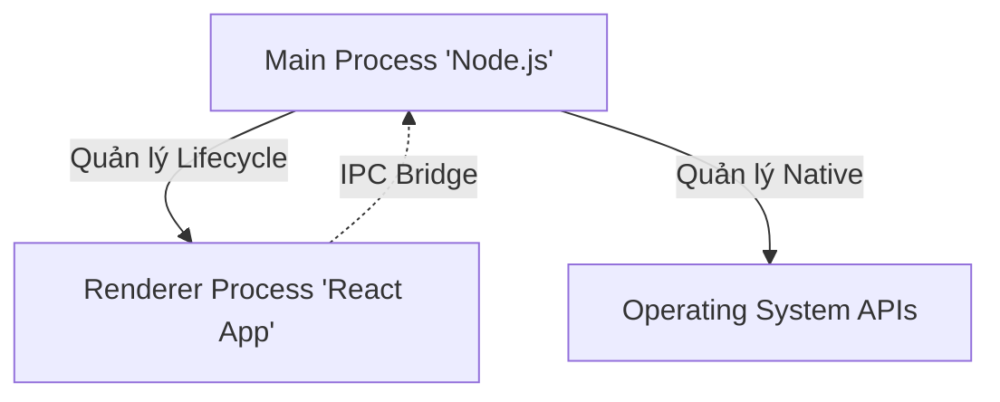

# 1. Core Technology Stack
## 1.1. Framework: Electron.js (Latest Stable)
- **Lý do lựa chọn:**
    - **Industry Standard:** Là công nghệ nền tảng của các ứng dụng quản lý hàng đầu thế giới như Visual Studio Code, Discord, Slack, Notion.
    - **Chromium Engine:** Đảm bảo giao diện React hiển thị nhất quán tuyệt đối, không phụ thuộc vào trình duyệt có sẵn trên máy người dùng (như IE hay Safari cũ).
    - **Node.js Integration:** Cho phép thực hiện các tác vụ hệ thống mà trình duyệt web không thể làm được (Ghi file local, truy cập phần cứng).
## 1.2. Ngôn ngữ: TypeScript
- **Áp dụng:** Toàn bộ mã nguồn Main Process và Renderer Process.
- **Lợi ích:** Đảm bảo Type Safety khi giao tiếp giữa Frontend (React) và lớp Desktop (Node.js), tránh các lỗi runtime khó debug trong môi trường đa tiến trình.
## 1.3. Đóng gói & Phân phối: Electron Builder
- **Vai trò:** Công cụ biên dịch mã nguồn thành các file cài đặt chuẩn (.exe, .dmg, .deb).
- **Tính năng:** Hỗ trợ Code Signing (Ký số ứng dụng) và Auto Update (Tự động cập nhật).

# 2. Mô hình Đa tiến trình (Multi-Process Architecture)
Electron hoạt động dựa trên mô hình đa tiến trình để đảm bảo độ ổn định và bảo mật. PronaFlow thiết kế mô hình này như sau:

## 2.1. Main Process (Tiến trình Chính)
- **Vai trò:** "Bộ não" của ứng dụng Desktop.
- **Trách nhiệm:**
    - Khởi tạo và quản lý vòng đời ứng dụng (Start, Quit).
    - Tạo và quản lý các cửa sổ trình duyệt (BrowserWindow).
    - Tương tác trực tiếp với Hệ điều hành (System Tray, Menu, Native Dialogs).
    - **Tuyệt đối không** thực hiện các tác vụ render giao diện để tránh chặn luồng chính (UI freeze).
## 2.2. Renderer Process (Tiến trình Hiển thị)
- **Vai trò:** Nơi hiển thị giao diện PronaFlow (chính là Frontend React đã thiết kế ở phần 5).
- **Đặc điểm:** Chạy trong môi trường Sandbox (Hộp cát), bị giới hạn quyền truy cập hệ thống để đảm bảo an toàn.
# 3. Cơ chế Giao tiếp và Bảo mật (IPC & Security)
Đây là phần quan trọng nhất để bảo vệ người dùng khỏi các lỗ hổng bảo mật (như RCE - Remote Code Execution).
## 3.1. Context Isolation (Cô lập Ngữ cảnh)
- **Nguyên lý:** Mặc định tắt `nodeIntegration` trong Renderer Process. Frontend React không được phép gọi trực tiếp `require('fs')` hay `require('child_process')`.
- **Giải pháp:** Sử dụng **Preload Scripts** để tạo ra một "Cầu nối" (Bridge).
## 3.2. IPC (Inter-Process Communication) Pattern

Giao tiếp giữa giao diện React và hệ thống Windows/macOS diễn ra qua mô hình Request/Response an toàn:
1. **Frontend (React):** Gọi hàm `window.electronAPI.saveFile(data)`.
2. **Preload Script:** Chuyển tiếp yêu cầu qua kênh `ipcRenderer.invoke('save-file', data)`.
3. **Main Process:** Lắng nghe sự kiện `ipcMain.handle('save-file')`, thực hiện ghi file xuống đĩa cứng bằng Node.js, sau đó trả kết quả về.
-> **Kết luận:** React chỉ biết gửi yêu cầu, không biết cách thực thi, đảm bảo hacker không thể lợi dụng Frontend để tấn công máy tính.
# 4. Các Tính năng Desktop Đặc thù (Native Capabilities)
PronaFlow Desktop cung cấp các tính năng vượt trội so với bản Web:
## 4.1. Hệ thống Thông báo Thông minh (Native Notifications)
- Tích hợp trực tiếp vào Notification Center của Windows/macOS.
- Hoạt động ngay cả khi ứng dụng đang thu nhỏ (Minimized) hoặc chạy ngầm (Background), đảm bảo người dùng không lỡ Deadline quan trọng.
## 4.2. Chế độ Hoạt động Ngoại tuyến (Offline-First Strategy)
- **Vấn đề:** Mất mạng Internet khiến công việc bị gián đoạn.
- **Giải pháp:** Tích hợp cơ sở dữ liệu nhúng **RxDB** hoặc **SQLite** (mã hóa) ngay bên trong ứng dụng Desktop.
    - Khi có mạng: Dữ liệu đồng bộ realtime với Server (PostgreSQL) qua REST API.
    - Khi mất mạng: Ứng dụng chuyển sang đọc/ghi vào Local Database. Mọi thay đổi (tạo Task, Comment) được xếp hàng đợi (Queue) và tự động đồng bộ lên Server ngay khi có mạng trở lại.
## 4.3. Tích hợp Hệ thống (System Integration)
- **Global Shortcuts:** Phím tắt toàn cục để gọi nhanh cửa sổ tạo Task (Quick Capture) từ bất kỳ đâu.
- **System Tray:** Biểu tượng trên thanh taskbar cho phép thao tác nhanh (Đổi trạng thái Online/Busy).
- **Auto-Launch:** Tùy chọn khởi động cùng hệ điều hành.