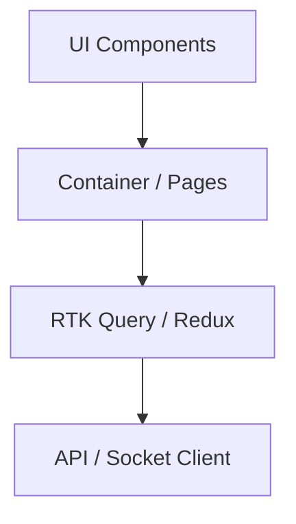

**Project**: PronaFlow
**Version**: 1.0
**State**: 
***Last updated:** Dec 31, 2025*

---
>[!NOTE] Phạm vi tài liệu
>Tài liệu đặc tả toàn bộ kiến trúc và công nghệ Frontend cho Hệ thống Quản trị Dự án Đa nên tảng - PronaFlow.
>Không bao gồm: 
>	1. Backend
>	2. AI/ML Service
>	3. Desktop Wrapper (Electron)
>	Các phần này được đặc tả ở tài liệu riêng

---
# 0. Architectural Principles
Frontend được thiết kế với các mục tiêu dài hạn sau.
- Maintainability: Dễ đọc - Dễ sửa - Dễ onboarding thành viên mới.
- Scalability: Mở rộng tính năng, module, team size mà không tài cấu trúc lớn.
- Performance: Tối ưu render, network, bundle size.
- Developer Experience ( #DX): Công cụ hiện đại, feadback nhanh, type-safe.
- Consitency: UI/UX đồng nhất, predictable state & Data flow.
# 1. Core Technology Stack 
## 1.1. Nền tảng phát triển: React (v18+)
- ***Vai trò***: Thư viện JavaScript cốt lỗi để xây dựng giao diện người dùng theo mô hình component-based.
- Lý do lựa chọn:
	- Declarative: UI giúp giao diện phản ánh trực tiếp state.
	- Virtual DOM: Tối ưu hóa hiệu năng render, đặc biệt quan trọng đối với các giao diện phức tạp, nhiều tương tác như Kanban Board.
	- Ecosystem: Hệ sinh thái phong phú, hỗ trợ mạnh mẽ tích hợp các thư viện kéo thả và biểu đồ dữ liệu.
	- React Hooks: Sử dụng mô hình Functional Programming giúp mã nguồn gọn gạng, dễ kiểm thử và tái sử dụng Logic.
- Nguyên tắc sử dụng:
	- Ưu tiên **Function Component + Hooks**
	- Tránh logic nghiệp vụ trong component UI
	- Component chỉ chịu trách nhiệm **render & interaction**
## 1.2. Ngôn ngữ: TypeScript (Strict Mode)
- ***Vai trò***: siêu tập hợp (Superset) của JavaScript, bổ sung tính năng định kiểu tĩnh (Static Typing).
- Lý do lựa chọn:
	- Type Safety: Giúp phát hiện lỗi ngay trong quá trình biên dịch (Compile-time), giảm thiểu các lỗi Runtime thường gặp trong JavaScrip thuần.
	- Self-documenting Code: Các Interface và Type Definition đóng vai trò như tài liệu sống, giúp các thành viên trong nhóm (hoặc chính tác giả khi xem lại) hiểu rõ cấu trúc dữ liệu trả về từu API AI/Backend.
- Quy ước: 
	- Bật `strict: true`
	- Không dùng `any` (trừ trường hợp wrapper kỹ thuật).
	- Tách `types / interfaces` theo domaindomain
## 1.3. Công cụ Build & Dev Server: Vite
- ***Vai trò***: Môi trường phát triển và build production.
- Lý do lựa chọn: 
	- Instant dev server (Native ES Modules)
	- Build nhanh, buidle tối ưu.
	- Phù hợp với React + TypeScript hiện đại.
# 2. Styling & Design System.
Để giải quyết các bài toán nghiệp vụ đặc thù của PronaFlow, các thư viện sau được tích hợp:
## 2.1. Styling Strategy: Tailwind CSS
**Vai trò**: Utility-first CSS Framwork đẻ xây dựng UI nhanh, nhất quán.
***Lý do lựa chọn***:
- Tránh CSS global khó kiểm soát.
- Scale tốt khi dự án lớn.
- Dễ enforce design consistency.
***Nguyên tắc***
- Không viết CSS thuần tràn lan.
- Dùng design token (color, spacing, radius).
- Component hóa UI thường dùng.
## 2.2. Component Library: Headless + UI primitives.
**Chiến lược**:
- Radix UI (Headless) cho accessibilitty & behavior.
- Custom UI layer bằng Taiwind.
**Lợi ích**
- Kiểm soát hoàn toàn UI.
- Không lock-in framework nặng.
- Dễ tái sử dụng, dễ đổi theme.

# 3. State Management & Data Flow.
## 3.1. Global State Management: Redux Toolkit ( #RTK)
- **Vấn đề giải quyết**: 
	- Trong ứng dụng quản lý dự án, các loại dữ liệu đặc thù như User, ProjectList, Active Task cần được truy cập từ nhiều Component khác nhau. 
	- Việc truyền props (Prop drilling) qua quá nhiều tầng sẽ gây khó bảo trì.
- Giải pháp: #RTK cung cấp *Single-Source-of-Truth*:
	- RTK Query: Một module mạng mẽ đi kèm để quản lý việc gọi API, Caching dữ liệu phía Client, và tự động đồng bộ hóa lại (Re-fetching) khi dữ liệu thay đổi, giảm tải gánh nặng xử lý thủ công.
# 4. Form & Validation
## 4.1. Form: React Hook Form:
- ***Áp dụng cho***: Các form đăng ký, tạo dự án, chỉnh sử task.
- Lý do lựa chọn:
	- Tối ưu hiệu năng bằng các giảm số lần re-render không cần thiết người dùng gõ phím.
	- API gọn nhẹ.
## 4.2. Validation Schema: Zod
- **Vai trò**: Định nghĩa Schema dữ liệu đầu vào.
- **Lợi ích**: 
	- Type-safe end-to-end: Giúp kiểm tra dữ liệu đầu vào (Input Validation) chặt chẽ trước khi gửi xuống Backend, đảm bảo tính toàn vẹn dữ liệu.
	- Có thể chia sẻ shcema với Backend (nếu cần).
# 5. Tương tác phức tạp.
## 5.1. Drag & Drop: @dnd-kit
- ***Áp dụng cho***: 
	- Phân hệ `4.4. (Kanban Project Management)` 
	- Record entity: task, task-list, sub-task và những thực thể cần thiết khác.
- Lý do lựa chọn:
	- Hiện đại và nhẹ.
	- Hỗ trợ tốt các sự kiện cảm ứng trên thiết bị di động (Touch Support).
	- Kiến trúc Modular, cho phép tùy biến thuật toán phát hiện va chạm (Collision Detection Algorithms) để xử lý logic kéo thả phức tạp giữa các cột.

# 6. Data Visulization: Recharts
- ***Áp dụng cho***: 
	- Phân hệ `4.10 (Analytics)`
	- Productivity, Progress, Resouce Allocation.
- Lý do lựa chọn:
	- Được xây dựng chuẩn cho React (Native React components).
	- Dễ tích hợp (Composable) để vẽ các biểu đồ quan trọng trong Data Science như Burn-down chart, Velocity histogram, Pie Chart phân bổ nguồn lực.
# 7. Real-time Communication: Socket.io - client.
- Áp dụng cho: 
	- Phân hệ `4.6. (collaboration)` 
	- Phân hệ `4.7. (Notifications)`
	- Live update Kanban
- Cơ chế: Thiết lập kết nối 2 chiều (Duplex connection) với Backend, cho phép server chủ động đẩy dữ liệu (Push) xuống client ngay khi có sự kiện mà không cần Client phải reload lại trang.
# Kiến trúc Frontend (High-Level)

# Nguyên tắc mở rộng & Bảo trì dài hạn.
- Tách rõ UI - State - Business Logic.
- Mỗi feature là một module độc lập.
- Không coupling UI với API response raw.
- Ưu tiên composition thay vì inheritance.
# Phạm vi loại trừ:
Tài liệu này không đặc tả:
- Backend API & Database.
- AI/ML Pipline & Model Serving.
- Desktop Wrapper (Electron)
- CI/CD & Infrastructure.
Các nội dung trên được quản lý bằng tài liệu riêng.