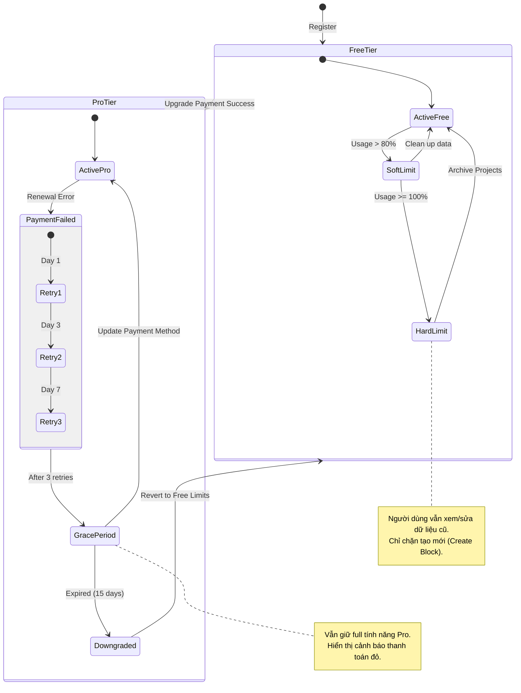

**Project**: PronaFlow
**Version**: 1.2 (Revised based on "Optimal Free Tier" philosophy)
**State**: Draft
***Last updated:** Jan 5, 2026*

---
## 1. Business Overview (Tổng quan Nghiệp vụ)
Trong nền kinh tế SaaS hiện đại, đặc biệt với triết lý **Product-Led Growth (PLG)**, mục tiêu của hệ thống tính phí không phải là tạo ra rào cản (Paywalls) ngay từ đầu, mà là đồng hành cùng sự phát triển của khách hàng.
Phân hệ **Subscription & Billing Management** của PronaFlow được thiết kế với tư duy: **"Free to Start, Pay to Scale"**.
1. **Gói Free (Starter):** Cung cấp trải nghiệm quản lý dự án **trọn vẹn** (Full Features) cho các nhu cầu cơ bản. Người dùng không bị cắt giảm các tính năng cốt lõi như Kanban, Gantt, hay Collaboration. Giới hạn chỉ nằm ở **tài nguyên tiêu thụ** (Storage, AI Tokens) và **phạm vi quản trị** (SSO, Audit Log dài hạn).
2. **Cơ chế Dual-Layer Billing:**
    - **Inbound:** Quản lý đăng ký gói cước linh hoạt, hỗ trợ tự động nâng cấp khi quy mô team mở rộng.
    - **Outbound (Work-to-Cash):** Biến PronaFlow thành công cụ kiếm tiền cho Freelancer/Agency bằng cách xuất hóa đơn từ Timesheet.
# 2. User Stories & Acceptance Criteria
## 2.1. Feature: Seamless Scaling (Nâng cấp mở rộng liền mạch)
### User Story 13.1
Là một **Workspace Owner (Gói Free)**, tôi muốn hệ thống cảnh báo nhẹ nhàng khi tôi sắp đạt giới hạn tài nguyên (Dung lượng/Số lượng dự án) thay vì khóa cứng tính năng ngay lập tức, và cho phép tôi nâng cấp nhanh chóng để tiếp tục mạch làm việc.
### Acceptance Criteria (#AC)
#### **AC 1 - Soft Limit Warning (Cảnh báo mềm):**
- **Trigger:** Khi tài nguyên đạt 80% và 90% (Ví dụ: Đã dùng 2.7/3 Dự án hoặc 900MB/1GB Storage).
- **Display:** Hiển thị thanh trạng thái sử dụng (Usage Bar) màu vàng/cam trên Dashboard hoặc Settings. Gửi email nhắc nhở "Workspace của bạn đang phát triển rất nhanh!".
#### **AC 2 - Graceful Enforcement (Cưỡng chế ân hạn):**
- **Scenario:** Người dùng đạt 100% giới hạn Projects.
- **Action:** Hệ thống **KHÔNG** khóa quyền truy cập các dự án cũ. Hệ thống chỉ tạm thời vô hiệu hóa nút "Create New Project" cho đến khi nâng cấp hoặc lưu trữ (Archive) bớt dự án cũ.
- **Philosophy:** Đảm bảo người dùng luôn xử lý được công việc hiện tại, không bao giờ bị "bắt làm con tin" về dữ liệu.
#### **AC 3 - Instant Upgrade (Nâng cấp tức thì):**
- Hỗ trợ nâng cấp gói Pro ngay trong luồng công việc (Contextual Upgrade) mà không cần tải lại trang hay đăng nhập lại. Các giới hạn (Quota) được mở rộng ngay lập tức sau khi thanh toán thành công (Webhook trigger).
## 2.2. Feature: Feature Gating for Power Users (Phân cấp tính năng nâng cao)
### User Story 13.2
Là một **Doanh nghiệp (Gói Pro)**, tôi muốn sử dụng các tính năng quản trị chuyên sâu như **SSO, Unlimited Audit Logs, và AI Advanced Insights**, để đảm bảo an ninh và tối ưu hóa vận hành cho đội ngũ lớn.
### Acceptance Criteria (#AC)
#### **AC 1 - Core vs. Power Features:**
- **Core (Free & Pro):** Task Management, Basic Gantt, Comments, File Sharing, Basic Reports.
- **Power (Pro Only):**
	- Custom Field nâng cao (Formula, Relation).
	- Advanced AI (Module 10 - Auto Schedule, Risk Prediction).
	- Data Retention vĩnh viễn (Free chỉ lưu Audit Log 90 ngày - theo Module 8).
#### **AC 2 - Teaser Experience (Trải nghiệm thử):**
- Cho phép người dùng Free dùng thử tính năng Pro (ví dụ: AI Prediction) với số lượng giới hạn (5 lần/tháng) để họ thấy giá trị trước khi mua.
## 2.3. Feature: Freelancer Invoicing (Hóa đơn đầu ra)
### User Story 13.3
Là một **Freelancer (Sử dụng cả Free/Pro)**, tôi muốn chuyển đổi dữ liệu chấm công (Timesheet) thành hóa đơn PDF chuyên nghiệp để gửi cho khách hàng, với khả năng tùy chỉnh thương hiệu.
### Acceptance Criteria (#AC)
#### **AC 1 - Basic Invoicing (Dành cho mọi người):**
- Cho phép chọn các Time Entries đã duyệt -> Tạo PDF hóa đơn cơ bản.
- Mẫu hóa đơn tiêu chuẩn của PronaFlow.
#### **AC 2 - Branded Invoicing (Dành cho Pro):**
- Cho phép tải lên Logo riêng, chỉnh sửa màu sắc Brand, bỏ dòng chữ "Powered by PronaFlow".
- Hỗ trợ gửi Email hóa đơn trực tiếp từ hệ thống với SMTP riêng.
#### **AC 3 - Payment Tracking:**
- Cho phép đánh dấu hóa đơn là `Sent`, `Paid`, `Overdue` thủ công.
## 2.4. Feature: Transparent Usage Dashboard (Bảng theo dõi minh bạch)
### User Story 13.4
Là một **Admin**, tôi muốn xem chi tiết mức độ tiêu thụ tài nguyên (Storage, AI Tokens, API Calls) theo thời gian thực, để hiểu rõ tôi đang trả tiền cho cái gì hoặc khi nào cần dọn dẹp dữ liệu.
### Acceptance Criteria (#AC)
#### **AC 1 - Resource Breakdown:**
- Biểu đồ Donut chart hiển thị dung lượng Storage: Files (80%), Database (10%), Backups (10%).
- Danh sách các "Heavy Projects" chiếm nhiều tài nguyên nhất.
#### **AC 2 - AI Token Usage:**
- Hiển thị số lượng Token đã dùng cho các tính năng AI (Gợi ý, Tóm tắt).
- Nếu là gói Free: Hiển thị số Token còn lại trong tháng (Quota reset định kỳ).
# 3. Business Rules & Technical Constraints
## 3.1. Quy tắc Dunning (Quản lý thu nợ tự động)
- **Retry Logic:** Nếu thanh toán gia hạn thất bại (do hết hạn thẻ, không đủ số dư), hệ thống tự động thử lại (Retry) theo lịch trình: Ngày 1, Ngày 3, Ngày 7.
- **Grace Period:** Cho phép người dùng tiếp tục sử dụng dịch vụ trong 7 ngày ân hạn (Grace Period) trước khi khóa quyền truy cập (Downgrade to Read-only).
## 3.2. Quy tắc Bất biến Tài chính (Financial Immutability)
- **Immutable Invoices:** Một khi hóa đơn đã được gửi đi (Sent) hoặc đã thanh toán (Paid), nội dung của nó **KHÔNG** được phép chỉnh sửa.
- Nếu có sai sót, người dùng phải thực hiện quy trình: Hủy hóa đơn cũ (Void) -> Tạo hóa đơn mới (New Invoice) hoặc tạo Credit Note (Giấy báo có).
## 3.3. Quy tắc Thuế (Tax Compliance)
- Hệ thống phải hỗ trợ tính thuế tự động dựa trên địa chỉ của người mua (Buyer's Location) để tuân thủ luật VAT (Châu Âu) hoặc Sales Tax (Mỹ).
- Tích hợp các service tính thuế (như Stripe Tax hoặc Avalara) nếu cần thiết.
# 4. Theoretical Basis (Cơ sở Lý luận)

## 4.1. Nguyên lý Kế toán Kép (Double-Entry Bookkeeping)
Mặc dù PronaFlow không phải là phần mềm kế toán chuyên sâu (như QuickBooks), module này vẫn áp dụng tư duy kế toán kép ở tầng dữ liệu (Ledger) để đảm bảo tính toàn vẹn:
- Mỗi giao dịch ghi nhận doanh thu phải có một bút toán đối ứng vào tài khoản phải thu (Accounts Receivable) hoặc tiền mặt (Cash).
- Công thức: $Assets = Liabilities + Equity$.
## 4.2. Mô hình Định giá SaaS (SaaS Pricing Models)
PronaFlow hỗ trợ mô hình **Per-User Pricing** (Tính tiền theo đầu người) kết hợp **Tiered Pricing** (Phân tầng).
- Đây là mô hình phổ biến nhất trong B2B SaaS vì tính dễ hiểu và khả năng mở rộng doanh thu tuyến tính theo sự phát triển của khách hàng (Scale with usage).
## 4.3. Bảo mật Giao dịch (Transaction Security & Idempotency)
Để ngăn chặn lỗi "Double Charge" (Trừ tiền 2 lần) trong môi trường mạng không ổn định, Module áp dụng **Idempotency Keys**:
- Mỗi request thanh toán gửi đi đều kèm theo một Key duy nhất (UUID).
- Nếu Client gửi lại request (do timeout), Server kiểm tra Key này. Nếu đã xử lý, Server trả về kết quả cũ mà không thực hiện trừ tiền lần 2.

