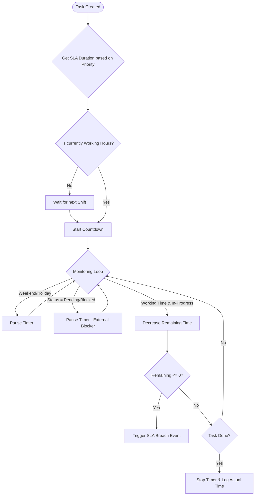

**Project**: PronaFlow 
**Version**: 1.1 
**State**: Draft 
*Last updated: Jan 04, 2026*

---
# 1. Business Overview
Module này đại diện cho phân hệ "Planning" (Hoạch định Dự án) chuyên sâu của dự án. Khác với việc quản lý thực thi hàng ngày (Task Execution - Module 4), module này tập truung vào tầm nhìn dài hạn và sự phụ thuộc giữa các đầu việc.
**Triết lý Thiết kế**: "***Optional & Scalable***": Hệ thống PronaFlow tôn trọng quy mô của từng dự án. Không phải dự án nào cũng cần biểu đồ Gantt phức tạp hay cơ chế tính toán lịch trình.
- **Đối với dựa án nhỏ** (**Simple/Agile**): Người dùng có thể bỏ qua module này. Họ chỉ cần tạo Task List, Task và Subtask (như Module 3&4 trình bày) để quản lý Dựa án đơn giản và gọn nhẹ.
- **Đối với Dự án lớn** (**Waterfall/Hybrid**): Project Leader có thể kích hợp chế độ "Planning". Khi đó, Project Leader có thể thực hiện các tác vụ hoạch định dự án, như Gantt Chart, Resource Balancing và SLA Tracking.
# 2. User Stories & Acceptance Criteria

## 2.1. Feature: Interactive Gantt Chart (Biểu đồ Gantt tương tác)
### User Story 5.1
Là một Project Manager, Tôi muốn trực quan hóa lịch trình dự án trên biểu đồ Gantt và thao tác kéo thả, Để nhìn thấy bức tranh tổng thể và điều chỉnh kế hoạch nhanh chóng.
### Acceptance Criteria ( #AC)
#### AC 1 - Visualization Elements
- **Timeline:** Trục hoành hiển thị thời gian (Zoom level: Day, Week, Month, Quarter).
- **Task Bars:**
    - Độ dài thanh = `Duration` (Start -> End).
    - Màu sắc thể hiện `Status` (Xanh: Done, Lam: In-progress).
    - Hiển thị `% Progress` lấp đầy bên trong thanh task.
- **Milestones:** Hiển thị các Task có cờ `Is Milestone = True` (từ Module 4) dưới dạng hình thoi (Diamond) màu vàng/đỏ.
#### AC 2 - Interaction (Kéo thả thông minh)
- **Move:** Kéo cả thanh Task để dời ngày (Shift Dates).
- **Resize:** Kéo cạnh phải để tăng/giảm `Duration`.
- **Constraint:** Nếu Task có Subtasks, thanh Task cha chỉ là bao hình (Wrapper), không thể kéo thả trực tiếp (Thời gian Task cha tự động = Min Start -> Max End của con).

## 2.2. Feature: Auto-Scheduling & Dependencies Impact
### User Story 5.2
Là một PM, Tôi muốn hệ thống tự động tính toán lại lịch trình khi có thay đổi, Để đảm bảo các ràng buộc phụ thuộc (Dependency) luôn được tuân thủ mà không cần chỉnh sửa thủ công hàng trăm task.
### Acceptance Criteria ( #AC)
#### AC 1 - Cascade Updates (Cập nhật dây chuyền)
- **Scenario:** Task A (Predecessor) bị trễ 2 ngày.
- **System Action:**
    - Tự động dời `Start Date` của Task B (Successor - quan hệ FS) lùi lại 2 ngày.
    - Tiếp tục dời Task C (Successor của B).
#### AC 2 - Conflict Highlighting
- Nếu việc dời lịch làm vi phạm `Hard Deadline` của Dự án hoặc Task cha, hệ thống hiển thị đường gạch chéo đỏ (Red Hash) trên vùng bị vi phạm và hiện cảnh báo: "Schedule Conflict".
#### AC 3 - Scheduling Mode (Chế độ lập lịch)
- Cho phép thiết lập trên từng Task:
    - **Auto-scheduled:** Tự động trôi theo Task trước (Mặc định).
    - **Manually-scheduled (Pinned):** Cố định ngày, không bị ảnh hưởng bởi Auto-scheduling. Hiển thị icon "Cái ghim" trên thanh Task.
#### AC 4 - Lag & Lead Time Configuration
- **Interaction:** Khi click đúp vào đường nối (Dependency Line) giữa 2 Task, hiển thị Modal/Popover cấu hình.
- **Input:** Cho phép nhập số ngày lệch (Offset Days).
    - Số dương (+2d): **Lag Time** (Chờ 2 ngày).
    - Số âm (-1d): **Lead Time** (Làm sớm 1 ngày trước khi việc trước kết thúc).
- **Calculation:** $Start(B) = End(A) + Offset$.
## 2.3. Feature: Critical Path Analysis (Phân tích Đường găng)
### User Story 5.3
Là một PM, Tôi muốn biết những công việc nào là quan trọng nhất quyết định thời gian hoàn thành dự án, Để tôi tập trung nguồn lực vào đó và không để chúng bị trễ.
### Acceptance Criteria ( #AC)
#### AC 1 - Highlight Critical Path
- **Toggle:** Có nút bật/tắt "Show Critical Path".
- **Visual:** Khi bật, hệ thống tô viền đỏ đậm cho các Task nằm trên đường găng (Tasks có `Total Float = 0`).
#### AC 2 - Dynamic Recalculation
- Khi người dùng rút ngắn thời gian một Task trên đường găng, hệ thống tính toán lại. Nếu đường găng thay đổi sang nhánh khác, cập nhật highlight tức thì.

## 2.4. Feature: Project Baselines (Vạch cơ sở)
### User Story 5.4
Là một PM, Tôi muốn lưu lại bản kế hoạch ban đầu trước khi dự án chạy, Để sau này so sánh được thực tế đang nhanh hay chậm hơn so với kế hoạch gốc.
### Acceptance Criteria ( #AC)
#### AC 1 - Create Snapshot
- **Action:** Chọn "Save Baseline".
- **System:** Lưu bản sao (Snapshot) của `Start Date`, `End Date`, `Duration` của toàn bộ Task tại thời điểm đó vào bảng `task_baselines`.
#### AC 2 - Visual Comparison
- Trên Gantt Chart, hiển thị 2 thanh song song cho mỗi Task:
    - **Thanh mờ (Gray bar):** Kế hoạch gốc (Baseline).
    - **Thanh màu (Colored bar):** Thực tế (Actual).
- Giúp PM nhìn thấy trực quan độ lệch (Variance).

## 2.5. Feature: Workload & Resource Balancing (Cân bằng nguồn lực)
### User Story 5.5
Là một PM, Tôi muốn nhìn thấy biểu đồ tải công việc của nhân viên ngay trong lúc lập kế hoạch, Để tránh việc giao quá nhiều việc cho một người trong cùng một ngày (Overallocation).
### Acceptance Criteria ( #AC)
#### AC 1 - Resource Histogram
- Dưới Gantt Chart có một panel hiển thị biểu đồ cột chồng (Stacked Bar) cho từng nhân sự theo ngày.
- **Ngưỡng:** Nếu tổng giờ làm việc dự kiến > 8h/ngày -> Cột chuyển màu đỏ (Overload).
#### AC 2 - Soft Warning
- Khi gán Task cho User A vào khung giờ họ đã bận, hiển thị Warning: "User A is overloaded on [Date]". Hệ thống vẫn cho phép lưu (Soft Constraint) nhưng cảnh báo rủi ro.

## 2.6. Feature: Calendar View (Giao diện Lịch)
### User Story 5.6
Là một Thành viên, Tôi muốn xem các công việc của mình dưới dạng lịch tháng/tuần, Để dễ hình dung lịch trình cá nhân.
### Acceptance Criteria ( #AC)
#### AC 1 - View Modes
- Hỗ trợ xem theo Tháng (Month), Tuần (Week), Ngày (Day).
- Cho phép lọc: "My Tasks", "Project Tasks".
#### AC 2 - External Sync (Tích hợp Module 12)
- Cung cấp link iCal/WebCal để đồng bộ 1 chiều sang Google Calendar/Outlook.
## 2.7. Feature: SLA Tracking (Theo dõi Cam kết Dịch vụ)
### User Story 5.7
Là một Quản lý, Tôi muốn thiết lập và theo dõi SLA cho các Task quan trọng, Để đảm bảo đội ngũ không chỉ hoàn thành việc mà còn đáp ứng đúng cam kết về thời gian phản hồi.
### Acceptance Criteria ( #AC)
#### AC 1 - SLA Definition
- Cho phép định nghĩa `SLA Policy` dựa trên độ ưu tiên (Priority).
    - _Urgent:_ 4 giờ làm việc.
    - _High:_ 1 ngày làm việc (8h).
    - _Normal:_ 3 ngày làm việc.
#### AC 2 - Business Hours Logic
- **Calculation:** Bộ đếm thời gian (Timer) chỉ chạy trong khung giờ làm việc (ví dụ: 08:00 - 17:00, T2-T6).
- **Exclusion:** Tự động trừ các ngày nghỉ lễ (Holidays) và cuối tuần (Weekends) được cấu hình trong Workspace Settings.
#### AC 3 - Visual Warning
Hệ thống hiển thị trạng thái SLA thông qua mã màu trên thẻ Task:
- **On Track (Xanh):** Thời gian trôi qua < 75% SLA.
- **At Risk (Vàng):** Thời gian trôi qua $\geq$ 75% SLA.
- **Breached (Đỏ):** Thời gian trôi qua > 100% SLA.
#### AC 4 - SLA Pause Conditions
- **Logic:** Đồng hồ SLA (Timer) phải **Tạm dừng** khi Task chuyển sang trạng thái thuộc nhóm `Blocking` (ví dụ: "Waiting for Customer", "Blocked").
- **Resume:** Đồng hồ tiếp tục chạy khi Task quay lại trạng thái `Active` (In-Progress).
- **Audit:** Ghi log lại khoảng thời gian bị Pause để giải trình khi xuất báo cáo.
## 2.8. Feature: Export & Reporting (Xuất dữ liệu)
### User Story 5.8 
- Là một PM, 
- Tôi muốn xuất biểu đồ Gantt ra file ảnh hoặc PDF, 
- Để báo cáo tiến độ trong các cuộc họp với Ban lãnh đạo (những người không truy cập hệ thống). 
### Acceptance Criteria ( #AC) 
#### AC 1 - Export Options 
- Hỗ trợ xuất ra: PDF (A4/A3 Landscape), PNG. 
- Tùy chọn khoảng thời gian xuất (Toàn bộ dự án hoặc Tháng này).
## 2.9. Feature: Planning Scope Control (Kiểm soát phạm vi hoạch định)
### Business Problem
Trong thực tế:
- Không phải **mọi Task** đều cần:
    - Auto-scheduling
    - CPM
    - Dependency cascade
- PM thường:
    - Chỉ hoạch định **Phase chính**
    - Hoặc **Task Level cao**
    - Còn Task chi tiết để team tự xử lý
Nếu không có Scope Control:
- Gantt quá phức tạp
- CPM nhiễu
- Auto-scheduling phá vỡ kế hoạch vi mô

> [!NOTE] Business Definition
> Planning Scope xác định Task/Phase nào được hệ thống coi là đối tượng hoạch định, tham gia vào các thuật toán Scheduling, CPM và Impact Analystic.
### User Story 5.9
Là một Project Manager, tôi muốn chỉ định phạm vi các Task/Phase được đưa vào hoạch định, để tập trung vào kế hoạch cấp cao mà không bị nhiễu bởi các Task chi tiết.
### Acceptance Criteria ( #AC)
#### AC 1 – Scope Flag
- Mỗi **Task / Task List / Phase** có thuộc tính:
    - `IncludeInPlanning: Boolean`
- Mặc định:
    - Level cao (Phase, Task List): `true`
    - Subtask chi tiết: `false`
#### AC 2 – Scope Inheritance
- Nếu Parent = `IncludeInPlanning = false`  
    → toàn bộ Children **tự động excluded**
- PM có thể override ở Child (nếu được quyền)
#### AC 3 – Behavior Rules
Task **không thuộc Planning Scope**:
- Không tham gia:
    - CPM
    - Auto-scheduling
    - Dependency cascade
-  Vẫn:
    - Hiển thị trên Gantt (màu xám nhạt)
    - Có thể gán người, cập nhật trạng thái
#### AC 4 – Visual Distinction
- Task ngoài scope:
    - Opacity giảm (30–40%)
    - Không vẽ dependency line
- Tooltip:
    > “This task is excluded from planning scope”
#### AC 5 – Scope Summary
- Panel hiển thị:
    - Tổng số Task trong scope
    - % phạm vi dự án được hoạch định
## 2.10. Feature: What-If Simulation Mode
### Business Problem
PM thường:
- Muốn thử:
    - Dời Task
    - Thêm Dependency
    - Rút Duration
- Nhưng:
    - Sợ phá kế hoạch thật
    - Không thấy trước hậu quả
Không có Simulation = **Hệ thống không an toàn cho quyết định chiến lược**
### User Story 5.10.
Là PM, tôi muốn mô phỏng thay đổi lịch trình để thấy tác động trước khi quyết định áp dụng.
### Acceptance Criteria ( #AC)
#### AC 1 – Enter Simulation Mode
- Toggle “Simulation Mode”
- UI chuyển:
	 - Màu nền vàng nhạt
	 - Watermark: _Simulation_
#### AC 2 – Simulation Behavior
Trong Simulation:
- Cho phép:
	 - Kéo Gantt
	 - Đổi Dependency
	 - Thay Duration
- Không ghi DB chính
- Tất cả thay đổi lưu trong **temporary simulation graph**
#### AC 3 – Impact Analysis Panel (Realtime)
Hiển thị:
- Δ Project End Date (+/- days)
- Tasks newly on Critical Path
- SLA at risk count
- Resource overload increase
#### AC 4 – Exit Options
Khi thoát Simulation:
- **Apply Changes**
	 - Ghi vào DB
	 - Recalculate baseline variance
- **Discard**
	 - Rollback toàn bộ
- **Save as New Baseline**
	 - Baseline v2 (optional)
### 3.5. Business Rules
- Simulation **không trigger notification**
- SLA Timer **không chạy trong Simulation**
- Baseline cũ **không bị ghi đè**
## 2.11. Feature: Planning Governance & Approval Workflow
### User Story 5.11
Là một Program Manager, Tôi muốn phê duyệt và khóa (Lock) kế hoạch dự án (Baseline) trước khi đưa vào thực thi, Để đảm bảo tính kỷ luật và ngăn chặn các thay đổi tùy tiện làm sai lệch cam kết với khách hàng.
### Acceptance Criteria (#AC)
#### AC 1 - Plan State Machine
- Trạng thái của Kế hoạch (Plan) tuân theo quy trình:
 1. **Draft:** PM đang soạn thảo, chỉnh sửa thoải mái.
 2. **Submitted:** Gửi yêu cầu phê duyệt.
 3. **Approved:** Được cấp trên phê duyệt. Tạo Baseline chính thức.
 4. **Locked:** Đã chốt.
#### AC 2 - Locked State Behavior
- Khi Plan ở trạng thái **Locked**:
 - Vô hiệu hóa tính năng kéo thả trên Gantt Chart.
 - Không cho phép thay đổi `Duration`, `Start/End Date` trực tiếp.
 - Mọi thay đổi bắt buộc phải thông qua quy trình **Change Request (CR)**.
#### AC 3 - Approval Audit
- Ghi nhận: Người duyệt, Thời gian duyệt và Version của Baseline tại thời điểm duyệt.
## 2.12. Feature: Change Impact Analysis (CIA) Panel
### User Story 5.12
Là một Project Manager, Tôi muốn hệ thống tự động phân tích và cảnh báo tác động của việc thay đổi một Task cụ thể, Để tôi hiểu rõ hậu quả (về tiến độ, chi phí) trước khi nhấn nút Lưu.
### Acceptance Criteria (#AC)
#### AC 1 - Pre-save Analysis
- **Trigger:** Khi người dùng thay đổi ngày hoặc dependency của một Task và nhấn Save.
- **Action:** Hệ thống hiển thị Panel "Impact Analysis" (chưa ghi vào DB ngay).
#### AC 2 - Impact Metrics
- Panel hiển thị rõ các thông số thay đổi ($\Delta$):
 - **Project End Date:** Trễ bao nhiêu ngày? (Ví dụ: +5 days).
 - **Critical Path:** Liệt kê các Task mới bị rơi vào đường găng.
 - **SLA Risk:** Số lượng Task có nguy cơ vi phạm SLA do sự thay đổi này.
 - **Resource Overload:** Số lượng nhân sự bị quá tải do lịch mới.
#### AC 3 - Confirmation
- Yêu cầu PM phải tick chọn: _"I understand the impact"_ (Tôi đã hiểu tác động) mới được phép Lưu thay đổi.
## 2.13. Feature: Planning Drift Analytics
### User Story 5.13
Là một Stakeholder, Tôi muốn theo dõi độ lệch tích lũy giữa Kế hoạch và Thực thi theo thời gian, Để biết được dự án đang trễ do khâu Lập kế hoạch yếu kém hay do khâu Thực thi chậm chạp.
### Acceptance Criteria (#AC)
#### AC 1 - Schedule Variance (SV) Tracking
- Hệ thống tính toán chỉ số SV theo từng giai đoạn (Phase):
 $$SV = Earned\ Value (EV) - Planned\ Value (PV)$$
- Hiển thị biểu đồ xu hướng (Trendline) của SV qua các tuần.
#### AC 2 - Phase Drift Heatmap
- Hiển thị biểu đồ nhiệt: Phase nào bị lệch nhiều nhất (Ví dụ: Phase "Testing" thường xuyên bị trễ 30% so với Baseline).
- **Insight:** Hệ thống đưa ra nhận định text: _"70% tổng thời gian trễ của dự án đến từ giai đoạn UAT"_.
## 2.14. Feature: Risk-aware Scheduling (Optional)
### User Story 5.14
Là một Risk Manager, Tôi muốn lập lịch dự án dựa trên xác suất rủi ro thay vì các con số cố định (Deterministic), Để có cái nhìn thực tế hơn về ngày hoàn thành khả dĩ (P50/P90).
### Acceptance Criteria (#AC)
#### AC 1 - Risk Buffer Input
- Cho phép nhập **Risk Factor (%)** trên từng Task hoặc cả Project.
- Hệ thống tự động cộng thêm **Buffer Time** vào đuôi Task nhưng đánh dấu rõ đây là thời gian dự phòng (không phải thời gian làm việc chính thức).
#### AC 2 - Probabilistic Dates
- Thay vì hiển thị 1 ngày kết thúc duy nhất, hệ thống tính toán và hiển thị:
 - **P50 Date:** Ngày có 50% khả năng hoàn thành.
 - **P90 Date:** Ngày có 90% khả năng hoàn thành (An toàn để cam kết với khách hàng).
#### AC 3 - Confidence Band
- Trên Gantt Chart, hiển thị vùng mờ (Shaded area) phía sau thanh Task thể hiện khoảng thời gian rủi ro có thể xảy ra.
## 2.15. Feature: Planning Permissions (RBAC)
### User Story 5.15
Là một Admin, Tôi muốn phân quyền chi tiết cho việc lập kế hoạch, Để phân biệt rõ ai là người thiết kế lịch trình và ai chỉ là người đóng góp ý kiến.
### Acceptance Criteria (#AC)
#### AC 1 - Planning Roles
- **Planner:** Quyền chỉnh sửa Gantt, tạo Dependency, lưu Baseline.
- **Contributor:** Quyền xem Gantt, comment vào Task, nhưng không được kéo thả lịch.
- **Approver:** Quyền duyệt Baseline (Feature 2.11).
#### AC 2 - Edit Lock
- Khi một Planner đang chỉnh sửa lịch trình (Edit Mode), hệ thống khóa quyền sửa của các Planner khác để tránh xung đột (Concurrent Editing Lock).
## 2.16. Feature: Advanced Planning Utilities
### User Story 5.16
Là một PM chuyên nghiệp, Tôi muốn có các công cụ tiện ích nâng cao để thao tác trên biểu đồ Gantt nhanh chóng và chính xác.
### Acceptance Criteria (#AC)
#### AC 1 - Gantt Undo/Redo
- Hỗ trợ `Ctrl+Z` / `Ctrl+Y` để hoàn tác các hành động kéo thả nhầm trên Gantt Chart (Lưu state tạm ở Client).
#### AC 2 - Baseline Versioning
- Quản lý danh sách các Baseline: `v1.0 (Initial)`, `v1.1 (Change Request #1)`, `v2.0 (Replanned)`.
- Cho phép chuyển đổi view để so sánh giữa các version Baseline khác nhau.
#### AC 3 - Freeze Window
- Cho phép thiết lập "Vùng đóng băng" (Ví dụ: 2 tuần tới).
- Các Task nằm trong vùng này bị khóa cứng, không cho phép Auto-scheduling tự động dời lịch, để đảm bảo ổn định cho team đang chạy Sprint.
## 2.17. Feature: Automated Resource Leveling (Cân bằng Nguồn lực Tự động)
### User Story 5.17
Là một Project Manager, Tôi muốn hệ thống tự động điều chỉnh lịch trình của các công việc không quan trọng để giải quyết tình trạng quá tải nhân sự, Để tối ưu hóa nguồn lực mà không cần phải dời từng Task thủ công.
### Acceptance Criteria (#AC)
#### AC 1 - Leveling Strategy Configuration
- **Action:** Khi nhấn nút "Level Resources", hiển thị Popup cho phép chọn chiến lược:
    1. **Within Slack (An toàn):** Chỉ dời các Task có độ trôi (`Total Float > 0`). Đảm bảo **không** làm trễ ngày kết thúc dự án.
    2. **Extend Project (Toàn diện):** Dời bất kỳ Task nào gây quá tải. Chấp nhận việc ngày kết thúc dự án bị kéo dài ra.
#### AC 2 - Heuristic Priority Logic
- Hệ thống sử dụng thuật toán ưu tiên để chọn Task nào sẽ bị dời (Delay) khi có xung đột tài nguyên:
    - **Priority 1:** Task có độ ưu tiên thấp hơn (Low Priority).
    - **Priority 2:** Task có độ trôi (Float) lớn hơn.
    - **Priority 3:** Task có thời lượng (Duration) ngắn hơn.
#### AC 3 - Visualization & Diff
- **Preview:** Trước khi áp dụng, hệ thống hiển thị bản xem trước (Shadow Bars) của lịch trình mới chồng lên lịch trình cũ.
- **Diff:** Hiển thị tóm tắt tác động: _"Sẽ dời 5 Tasks, giảm 80% xung đột, ngày kết thúc dự án tăng 2 ngày"_.
#### AC 4 - Constraint Adherence
- Thuật toán Leveling **tuyệt đối không** được dời các Task:
    - Đang ở trạng thái `Started` / `Done`.
    - Có ràng buộc cứng (`Must Start On`, `Locked`).
    - Task đã được phê duyệt trong Freeze Window (Feature 5.16).
## 2.18. Feature: Cross-Project Dependencies (Phụ thuộc Đa Dự án)
### User Story 5.18
Là một Program Manager, Tôi muốn thiết lập mối quan hệ phụ thuộc giữa các công việc thuộc hai dự án khác nhau, Để nhìn thấy bức tranh tổng thể và đánh giá được tác động dây chuyền (Domino Effect) khi một dự án thành phần bị chậm trễ.
### Acceptance Criteria (#AC)
#### AC 1 - External Predecessor Selection
- **Action:** Trong hộp thoại "Add Dependency", bổ sung tùy chọn: _Source = External Project_.
- **Interaction:**
    1. Chọn Dự án nguồn (Dropdown list - chỉ hiện các dự án User có quyền truy cập).
    2. Tìm kiếm Task nguồn (Search by Name/ID).
    3. Chọn loại quan hệ (FS/SS...).
- **Result:** Tạo một liên kết logic giữa Task A (Project 1) và Task B (Project 2).
#### AC 2 - Ghost Task Visualization (Hiển thị Task "Bóng ma")
- Trên biểu đồ Gantt của Dự án đích (Project 2)
    - Hiển thị Task nguồn (từ Project 1) dưới dạng **"Ghost Bar"** (Thanh mờ, màu xám nhạt, nét đứt).
    - **Tooltip:** Khi hover vào Ghost Bar, hiển thị rõ: _"External Dependency: [Project 1] - Task A - End: 15/10/2025"_.
    - Không cho phép sửa đổi Ghost Task này tại đây (Read-only).
#### AC 3 - Impact Propagation (Lan truyền tác động)
- **Scenario:** Khi Task A (Project 1) bị dời ngày kết thúc trễ 3 ngày.
- **System Action:**
    - Tự động tính toán lại ngày bắt đầu của Task B (Project 2).
    - Gửi thông báo **Critical Alert** cho PM của Project 2: _"Task B is impacted by delay in Project 1"_.
    - Đánh dấu trạng thái **"Sync Pending"** trên Gantt Chart nếu Project 2 đang bị Lock/Freeze.
## 2.19. Feature: Calendar Exception Handling (Xử lý Ngoại lệ Lịch biểu)
### User Story 5.19
Là một Thành viên dự án, Tôi muốn đăng ký lịch nghỉ phép (Leave Request) và hệ thống tự động cập nhật lại kế hoạch các Task được gán cho tôi, Để PM không phải điều chỉnh thủ công và Deadline được tính toán chính xác.
### Acceptance Criteria (#AC)
#### AC 1 - Personal Exception Input (Đăng ký ngoại lệ cá nhân)
- **Action:** User có thể đánh dấu các ngày cụ thể trên Calendar cá nhân là: _Vacation_, _Sick Leave_, hoặc _Half-day Off_.
- **Sync:** Dữ liệu này có thể được đồng bộ từ module HRM (nếu có tích hợp) hoặc nhập tay.
#### AC 2 - Availability Conflict Warning
- **Scenario:** Khi PM gán Task cho User A vào ngày họ đã đăng ký nghỉ phép.
- **System Action:**
    - Hiển thị cảnh báo: _"User A is unavailable on [Date] due to [Reason]"_.
    - Đề xuất: _"Gán cho người khác"_ hoặc _"Tự động kéo dài Task qua ngày nghỉ"_.
#### AC 3 - Task Splitting (Chia tách công việc)
- **Logic:** Nếu một Task dài 5 ngày (T2 -> T6) nhưng User nghỉ phép vào Thứ 4.
- **Result:** Hệ thống tự động chia Task thành 2 phân đoạn (Segments) trên Gantt Chart:
    - Segment 1: T2, T3.
    - Segment 2: T5, T6, T7 (Kéo dài thêm 1 ngày làm việc để bù cho Thứ 4).
    - Ngày Thứ 4 được tô xám (Non-working) trên dòng Task đó.
# 3. Business Rules (Quy tắc Nghiệp vụ)
## 3.1. Quy tắc Toàn vẹn Thời gian (Temporal Integrity)
1. **Parent-Child Constraint:** Khoảng thời gian của Task List (Parent) là bao trùm (union) của tất cả các Task con.
    - $Start(Parent) = \min(Start(Children))$
    - $End(Parent) = \max(End(Children))$
2. **Milestone Logic:** Milestone là một điểm thời gian, không có thời lượng ($Duration = 0$). Milestone không thể có Subtask.
## 3.2. Quy tắc Lập lịch (Scheduling Rules)
- **Dependency:** Mặc định FS (Finish-to-Start). Nếu vi phạm (Task sau bắt đầu trước khi Task trước kết thúc), hệ thống tự động đẩy Task sau lùi lại (trừ khi Task sau đang ở chế độ *Pinned*).
- **Non-working Days:** Task tự động kéo dài qua ngày nghỉ. Ví dụ: Task 2 ngày bắt đầu thứ 6 sẽ kết thúc vào thứ 2 (nếu T7, CN nghỉ).
## 3.3. Quy tắc SLA (Service Level Agreement)
- **SLA Timer:** Chỉ chạy trong giờ hành chính (Working Hours: 08:00 - 17:00).
- **Breach Logic:**
    - Khi thời gian thực hiện > SLA quy định (theo Priority trong Module 4).
    - Hành động: Gửi email cho Manager + Đổi màu Task sang Đỏ.
## 3.4. Quy tắc Ràng buộc Task (Constraint Types)
Hệ thống phân biệt 2 loại ràng buộc ngày tháng để xử lý xung đột:
1. **Soft Constraint (Mềm):** "Start No Earlier Than".
    - Áp dụng cho Task thường.
    - _Hành vi:_ Nếu Task trước bị đẩy lùi, Task này trôi theo.
2. **Hard Constraint (Cứng):** "Must Start On" / "Must Finish On".
    - Áp dụng cho Task có chế độ **Pinned** (Ghim).
    - _Hành vi:_ Hệ thống **không bao giờ** tự động thay đổi ngày của Task này. Nếu Task trước đẩy lùi đè lên ngày của Task này -> Báo lỗi xung đột (Conflict) đỏ rực trên UI.
## 3.5. Quy tắc Đa Múi giờ (Multi-Timezone Strategy)
- **Lưu trữ:** Mọi thời gian trong Database phải lưu dưới dạng chuẩn **UTC**.
- **Hiển thị:** Gantt Chart hiển thị theo múi giờ của **Project Settings** (không phải múi giờ của User đang xem).
    - _Lý do:_ Đảm bảo tất cả thành viên nhìn thấy cùng một kế hoạch thống nhất, tránh việc User ở Mỹ thấy Task bắt đầu thứ 5, User ở Việt Nam thấy bắt đầu thứ 6 gây hiểu lầm deadline.
## 3.6. Quy tắc Leo thang SLA (SLA Escalation Rule)
- **Cơ chế:** Nếu một Task bị vi phạm SLA (Breached) và không được xử lý trong vòng X giờ tiếp theo:
    1. **Level 1:** Gửi email nhắc nhở Assignee.
    2. **Level 2:** Gửi thông báo cho Line Manager.
    3. **Level 3 (Auto-Action):** Tự động chuyển Task sang trạng thái "At Risk" hoặc Re-assign cho Team Lead (tùy cấu hình).
## 3.7. Quy tắc Kiểm toán Lập lịch (Planning Audit Trail)
- Mọi thay đổi tác động đến **Start Date**, **End Date**, **Duration**, hoặc **Dependency** đều phải lưu vết:
    - _Who:_ Ai thay đổi?
    - _From:_ Giá trị cũ (Old Value).
    - _To:_ Giá trị mới (New Value).
    - _Reason:_ Lý do thay đổi (bắt buộc nhập nếu Dự án đang ở trạng thái Locked/In-Progress).
## 3.8. Quy tắc Bảo toàn Đường găng (Critical Path Preservation Rule)
- Trong chế độ Leveling mặc định (_Within Slack_), hệ thống được phép tiêu thụ **Free Float** (độ trôi tự do) của Task.
- Nếu việc dời Task làm tiêu tốn hết Float và biến Task đó thành Critical Task (Float = 0), hệ thống phải dừng lại và không dời thêm nữa, ngay cả khi nhân sự vẫn còn quá tải (ưu tiên Deadline hơn Resource).
## 3.9. Quy tắc Toàn vẹn Tham chiếu Chéo (Cross-Reference Integrity)
- **Permission Check:** Để tạo Dependency chéo, người dùng phải có quyền **View** ở Dự án nguồn và quyền **Edit** ở Dự án đích.
- **Broken Link Handling:** Nếu Task nguồn (Project 1) bị xóa hoặc Dự án 1 bị Archive:
    - Hệ thống **không** xóa Dependency mà chuyển nó sang trạng thái **"Broken"** (Gãy liên kết).
    - Hiển thị icon cảnh báo tam giác vàng trên Task đích (Project 2) để PM biết và xử lý thủ công (Xóa link hoặc nối lại vào Task khác).
## 3.10. Quy tắc Thứ bậc Lịch biểu (Calendar Hierarchy Precedence)
Hệ thống áp dụng cơ chế **"Calendar Layering"** (Lớp lịch) để xác định một ngày cụ thể là "Working" hay "Non-working". Thứ tự ưu tiên từ cao xuống thấp như sau:
1. **Individual Exception:** Lịch nghỉ phép/làm bù của từng cá nhân (Cao nhất).
2. **Project Calendar:** Lịch đặc thù của dự án (ví dụ: Team onsite làm việc cả T7 để kịp tiến độ).
3. **Workspace Calendar:** Lịch nghỉ lễ chung của công ty (Quốc khánh, Tết)
4. **System Default:** T2-T6, 09:00-18:00 (Thấp nhất). -> _Ví dụ:_ Nếu Công ty nghỉ lễ (Layer 3), nhưng Dự án quy định làm việc (Layer 2) -> Ngày đó là Working Day cho team dự án đó.
# 4. Theoretical Basis & Algorithms (Cơ sở Lý luận & Thuật toán)
## 4.1. Phương pháp Đường găng (Critical Path Method - CPM)
Hệ thống tự động xác định chuỗi các công việc quyết định thời gian hoàn thành dự án.
- **Forward Pass (Tính toán xuôi):** Xác định thời gian sớm nhất ($ES, EF$).
    - $ES(Task) = \max(EF(Predecessors))$
    - $EF(Task) = ES(Task) + Duration$
- **Backward Pass (Tính toán ngược):** Xác định thời gian muộn nhất ($LS, LF$).
    - $LF(Task) = \min(LS(Successors))$
    - $LS(Task) = LF(Task) - Duration$
- **Float/Slack (Độ trôi):** $Float = LS - ES$.
    - Nếu $Float = 0$: Task nằm trên đường găng (Critical Task). Bất kỳ sự chậm trễ nào của task này đều làm trễ cả dự án. Hệ thống sẽ tô đỏ các task này trên Gantt Chart.
## 4.2. Thuật toán tính toán SLA (SLA Calculation Algorithm)
Đây là thuật toán xử lý sự chênh lệch giữa thời gian thực tế (Calendar Time) và thời gian làm việc (Business Time).
Công thức xác định thời điểm vi phạm ($T_{breach}$):
$$T_{breach} = T_{start} + D_{sla} + \sum T_{off\_shift} + \sum T_{holidays}$$
**Trong đó:**
- $T_{start}$: Thời điểm bắt đầu tính giờ (Status chuyển sang In-Progress).
- $D_{sla}$: Thời lượng cam kết (ví dụ: 4 giờ).
- $\sum T_{off\_shift}$: Tổng thời gian ngoài giờ hành chính nằm giữa khoảng thời gian xử lý.
- $\sum T_{holidays}$: Tổng thời gian các ngày lễ/nghỉ phép.
_Ví dụ minh họa:_
- SLA: 4 giờ.
- Start: 16:00 Thứ Sáu.
- Giờ làm việc: 08:00 - 17:00 (Nghỉ trưa 12:00-13:00).
- Tính toán:
    - 16:00 -> 17:00 Thứ 6: Tiêu tốn 1 giờ. (Còn lại 3h).
    - 17:00 T6 -> 08:00 Thứ 2: Off-shift (Cuối tuần).
    - 08:00 -> 11:00 Thứ 2: Tiêu tốn 3 giờ.
- **Kết quả:** $T_{breach}$ là 11:00 Thứ Hai tuần kế tiếp.
## 4.3. Thuật toán Cân bằng Nguồn lực (Resource Leveling Heuristics)
PronaFlow giải quyết bài toán "Resource Constrained Scheduling Problem" (RCSP) - một bài toán NP-Hard - bằng phương pháp Heuristic (Quy tắc kinh nghiệm) thay vì tối ưu hóa toán học tuyệt đối (vì quá tốn tài nguyên tính toán).
- **Nguyên lý "Song song":**
    1. Sắp xếp danh sách tất cả các Task theo thời gian bắt đầu ($ES$).
    2. Duyệt qua từng đơn vị thời gian (t) từ đầu đến cuối dự án.
    3. Tại mỗi thời điểm $t$, tính tổng nhu cầu tài nguyên $R(t)$.
    4. Nếu $R(t) > Capacity_{limit}$:
        - Chọn tập hợp các Task đang tranh chấp tài nguyên.
        - Giữ lại Task có _Priority_ cao nhất hoặc _Slack_ ít nhất.
        - Đẩy lùi ($Delay$) các Task còn lại sang thời điểm $t+1$.
    5. Cập nhật lại mạng lưới Dependency và tính lại $ES, LS$.
- **Kết quả:** Tạo ra một lịch trình khả thi về mặt vật lý (không ai làm quá 24h/ngày) với sự thay đổi tối thiểu so với kế hoạch gốc.
## 4.4. Phương pháp Đường găng Đa dự án (Multi-Project Critical Path Method - MCPM)
- **Vấn đề:** Trong môi trường đa dự án, đường găng của Dự án B có thể không nằm trong nội bộ Dự án B, mà bị chi phối bởi một Task nằm ở Dự án A.
- **Giải pháp:** PronaFlow xây dựng đồ thị phụ thuộc ảo (Virtual Dependency Graph) kết nối các nút giữa các dự án khác nhau.
    - Khi tính toán CPM cho Project B, hệ thống coi Task A (External) như một ràng buộc cứng về thời gian ($Start \geq End_{external}$).
    - Điều này giúp Ban lãnh đạo nhìn thấy **"Global Critical Path"** (Đường găng toàn cục) của cả chương trình.
## 4.n. Biểu đồ Logic SLA

