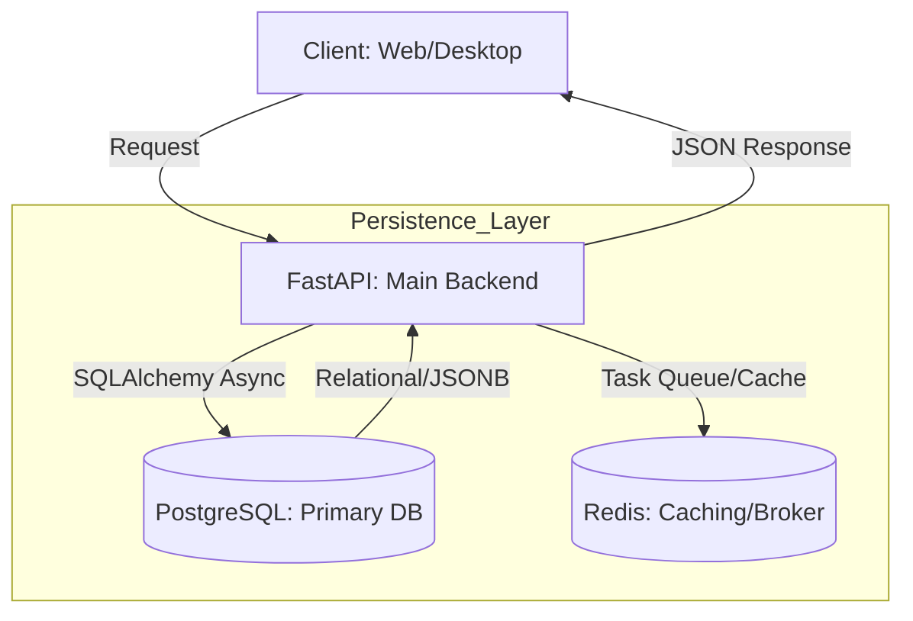

- Dự án: PronaFlow
- Version: 1.0
- ID: ADR-002
- **Tiêu đề:** Lựa chọn PostgreSQL làm Cơ sở dữ liệu Chính (Primary Database)
- **Trạng thái:** Đã phê duyệt (Accepted)
- **Ngày cập nhật:** 15/01/2026

---
# 1. Context
Hệ thống PronaFlow đòi hỏi khả năng quản lý dữ liệu phức tạp, bao gồm cả dữ liệu có cấu trúc (thông tin dự án, người dùng, phân quyền #RBAC ) và dữ liệu phi cấu trúc (các cấu hình linh hoạt, log hệ thống). 
Vì thế, cần một giải pháp lữu trữ đảm bảo tính toàn vẹn dữ liệu tuyệt đối, hiệu năng cao cho các truy vấn quan hệ và khả năng mở rộng tốt để phục vụ phân hệ AI và phân tích dữ liệu sau này.
# 2. Decision
- Sử dụng **PostgreSQL (v15+)*** làm hệ quản trị CSDL quan hệ chính (Primary Relational Database) cho toàn bộ dịch vụ Backend Core.
- Các quyy tắc triển khai chính:
	- **Quyền truy cập:** Main Backend nắm giữ quyền Đọc/Ghi (Read/Write) độc quyền đối với CSDL này.
	- **Tương tác dữ liệu:** Sử dụng **SQLAlchemy (Async)** làm mô hình ORM để tương tác thông qua các Class Python, giúp tránh lỗ hổng SQL Injection và dễ bảo trì.
	- **Loại dữ liệu:** Kết hợp lưu trữ Relational Data truyền thống và JSON Documents cho các trường dữ liệu tùy biến.
# 3. Rationale
- **Tính toàn vẹn dữ liệu (ACID Compliance):** PostgreSQL đảm bảo dữ liệu nghiệp vụ (như giao dịch tài chính, trạng thái dự án) luôn chính xác và nhất quán.
- **Hỗ trợ JSONB:** Cho phép PronaFlow linh hoạt trong việc lưu trữ các thuộc tính mở rộng của Task/Project mà không cần thay đổi schema liên tục.
- **Hiệu năng bất đồng bộ:** Tương thích hoàn hảo với kiến trúc Async I/O của FastAPI thông qua các driver như `asyncpg`.
- **Hệ sinh thái phong phú:** Hỗ trợ tốt cho các extension như PostGIS (nếu cần xử lý địa lý) hoặc các công cụ tối ưu hóa AI.
# Data-Flow

# User Story: Quản lý tính nhất quán dữ liệu
## **User Story:**
- **Là một** Quản trị viên hệ thống (System Admin), **tôi muốn** mọi thao tác cập nhật trạng thái dự án phải được thực hiện thông qua các giao dịch (Transactions) an toàn, **để** đảm bảo rằng không bao giờ xảy ra tình trạng sai lệch dữ liệu khi có nhiều người dùng cùng thao tác.
## **Tiêu chí chấp nhận (Acceptance Criteria):**
1. **AC1 (Tính nguyên tử):** Given (Khi) một yêu cầu cập nhật dự án bao gồm nhiều bước (ghi log, đổi trạng thái), When (Thì) nếu một bước thất bại, Then (Sau đó) toàn bộ quá trình phải được rollback về trạng thái ban đầu.
2. **AC2 (Truy cập đồng thời):** Given hệ thống có hàng trăm người dùng cùng truy cập, When hai người dùng cùng cập nhật một Task, Then hệ thống phải sử dụng cơ chế khóa (Locking) của PostgreSQL để tránh ghi đè dữ liệu sai.
3. **AC3 (Dữ liệu tùy biến):** Given người dùng thêm các trường dữ liệu mới vào dự án, When hệ thống lưu trữ, Then dữ liệu đó phải được ghi vào cột JSONB của PostgreSQL mà không làm chậm tốc độ truy vấn chung.