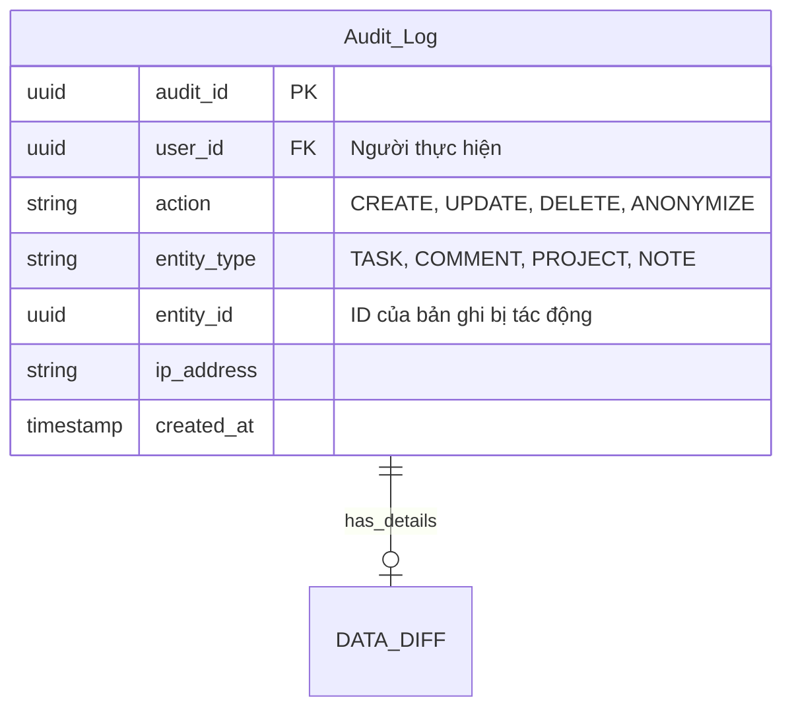

> Phục vụ mục đích kiểm toán (Auditing) và truy vết hành động trong hệ thống. Accouting / Auditing ( #AAA)
# Module 1

| Field       | Type      | Key | Constrant | Note                                         |           |
| ----------- | --------- | --- | --------- | -------------------------------------------- | --------- |
| audit_id    | UUID      | PK  |           | Định danh duy nhất kiểu UUID                 |           |
| user_id     | UUID      | FK  |           | Người thực hiện                              | [[Users]] |
| action      | varchar   |     |           | Loại tác động (CRUD, Anonymize)              |           |
| entity_type | string    |     |           | Task, Comment, Project, Note, ...            |           |
| entity_id   | UUID      |     |           | ID của bản ghi bị tác động                   |           |
| ip_address  | varchar   |     |           | Địa chỉ IP tại thời điểm thực hiện hành động |           |
| created_at  | timestamp |     |           | Thời điểm ghi nhận nhật ký                   |           |

