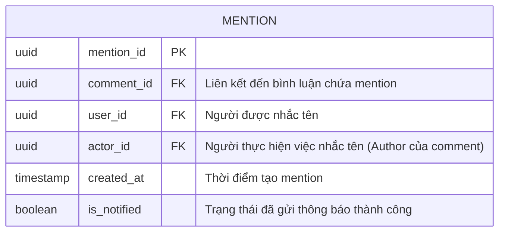

# module 6

| Field       | Type      |     |                                                   |
| ----------- | --------- | --- | ------------------------------------------------- |
| mention_id  | UUID      | PK  |                                                   |
| comment_id  | UUID      | FK  | Liên kết đến bình luận chứa mention               |
| user_id     | UUID      |     | Người được nhắc tên                               |
| actor_id    | UUID      |     | Người thực hiện việc nhắc tên (Comment's Author ) |
| created_at  | timestamp |     | Thời điểm tạo mention                             |
| is_notified | boolean   |     | Trạng thái đã gửi thông báo thành công            |
- Trigger sang Module 7 - [[Notification|Module 7 - Notification Entity]]

