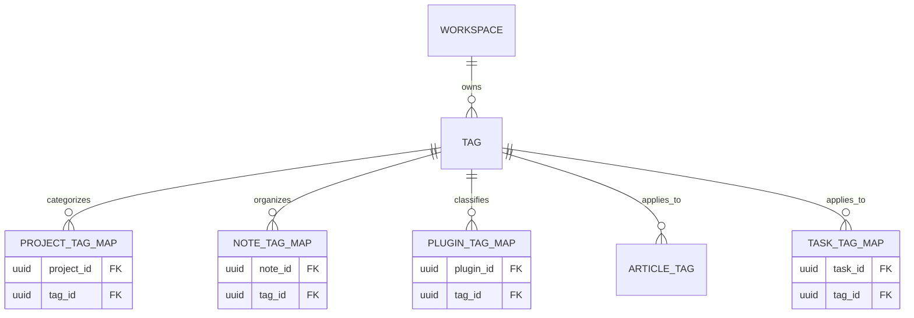

# Module 4 and 15

| Field             | Type      | Key | Description                                          |
| ----------------- | --------- | --- | ---------------------------------------------------- |
| tag_id            | UUID      | PK  |                                                      |
| workspace_id      | UUID      | FK  | [[Workspace]]                                        |
| name              | varchar   |     | Tên thẻ                                              |
| color_code        | varchar   |     | Mã màu HEX                                           |
| entity_type_limit | enum      |     | Giới hạn tag này chỉ dùng cho Task, Project hoặc All |
| created_at        | timestamp |     | Thời điểm tạo                                        |

