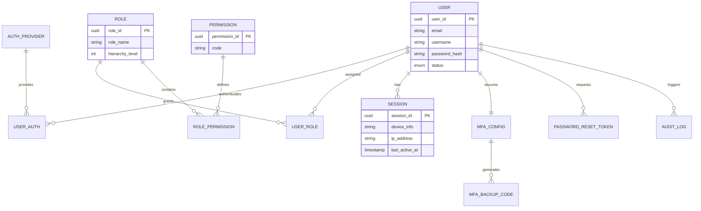

**Project**: PronaFlow 
**Version**: 1.0
**State**: Draft 
_**Last updated:** Jan 9, 2026_

---
# 1. Entity Mapping.
Bảng đặc tả chi tiết khác bảng dữ liệu trong ERD giải quyết các yêu cầu nghiệp vụ.

| **User Story** | HyperLink - User Story                                | **Tính năng nghiệp vụ**  | **Thực thể liên quan (ERD Table)**                               | **Logic xử lý chính**                                                                   |
| -------------- | ----------------------------------------------------- | ------------------------ | ---------------------------------------------------------------- | --------------------------------------------------------------------------------------- |
| **US 1.1**     | [[1 - Identity and Access Management#User Story 1.1]] | Đăng ký & Xác thực Email | `USER`                                                           | Trường `status` dùng để quản lý trạng thái `PENDING` và `ACTIVE`.                       |
| **US 1.2**     | [[1 - Identity and Access Management#User Story 1.2]] | Đăng nhập an toàn        | `USER`, `SESSION`                                                | Kiểm tra `password_hash`. `SESSION` ghi lại `ip_address` và `device_info`.              |
| **US 1.3**     | [[1 - Identity and Access Management#User Story 1.1]] | Phân quyền (RBAC)        | `ROLE`, `PERMISSION`, `USER_ROLE`, `ROLE_PERMISSION`             | Thực thi quyền dựa trên `hierarchy_level` và mã `code` của quyền.                       |
| **US 1.4**     | [[1 - Identity and Access Management#User Story 1.4]] | Khôi phục mật khẩu       | `PASSWORD_RESET_TOKEN`                                           | Token duy nhất liên kết với `user_id`, có thời gian hết hạn (15 phút).                  |
| **US 1.5**     | [[1 - Identity and Access Management#User Story 1.5]] | Xác thực đa yếu tố (MFA) | `MFA_CONFIG`, `MFA_BACKUP_CODE`                                  | `MFA_CONFIG` lưu cấu hình (TOTP), `MFA_BACKUP_CODE` chứa 10 mã dự phòng.                |
| **US 1.6**     | [[1 - Identity and Access Management#User Story 1.6]] | Quản lý phiên làm việc   | `SESSION`                                                        | Theo dõi `last_active_at`. Hỗ trợ đăng xuất từ xa bằng cách xóa bản ghi trong bảng này. |
| **US 1.7**     | [[1 - Identity and Access Management#User Story 1.7]] | Đăng nhập MXH (OAuth2)   | `USER_AUTH`, `AUTH_PROVIDER` [[UserAuth]] [[AuthProvider]] | Liên kết định danh từ nhà cung cấp bên ngoài (Google, GitHub) với `user_id` nội bộ.     |
| **Audit**      |                                                       | Nhật ký hệ thống         | `AUDIT_LOG` [[AuditLog]]                                      | Ghi lại mọi hành động thay đổi trạng thái bảo mật của `USER`.                           |
# 2. Business Logic Details.
## 2.1. #MFA Authentication Flow.
Dựa trên bảng [[MFAConfig]] và [[MFABackupCode]]:
- **Khi đăng nhập (Login)**: Hệ thống kiểm tra bảng  `MFA_Config`. Nếu tồn tại bản ghi và trạng thái kích hoạt, bắt buộc người dùng nhập mã 6 số ( #TOTP)
- **Sử dụng mã dự phòng**: Nếu người dùng nhập mã từ bảng `MFA_BACKUP_CODE`, mã đó phải được đánh dấu là "Đã sử dụng" (hoặc xóa đi) và không thể tái sử dụng.
## 2.2. Kiểm soát quyền hạn (Hierarchical #RBAC)
Bảng [[Roles]] có trường `hierarchy_level (int)`:
- Quy tắc: Một người dùng có `hierarchy_level` thấp hơn (ví dụ: Owner = 1) có thể quản lý các vai trò có level cao hơn (Admin = 2, Member = 3).
- Kiểm soát quyền: Mọi Request API phải đi qua middleware kiểm tra bảng [[RolePermission]]. Nếu [[Permissions|PERMISSION.code]] yêu cầu không nằm trong ddánhacsh quyền của [[UserRole]], hệ thống trả về lỗi 403.
## 2.3. Bảo vệ tài khoản & Session:
- Brute-force: Logic này không nằm trực tiếp trong ERD nhưng sẽ tác động đến trường [[Users|USER.status]]. Nếu vi phạm, `status` chuyển thành `BLOCKED`.
- Giới hạn 5 phiên: Trước khi insert vào bảng [[Session]] Hệ thống đếm số lượng bản ghi hiện của của `user_id`. Nếu bằng 5, thực hiện xóa bản ghi có `last_active_at` cũ nhất trước khi thêm phiê mới.
# 3. ERD

