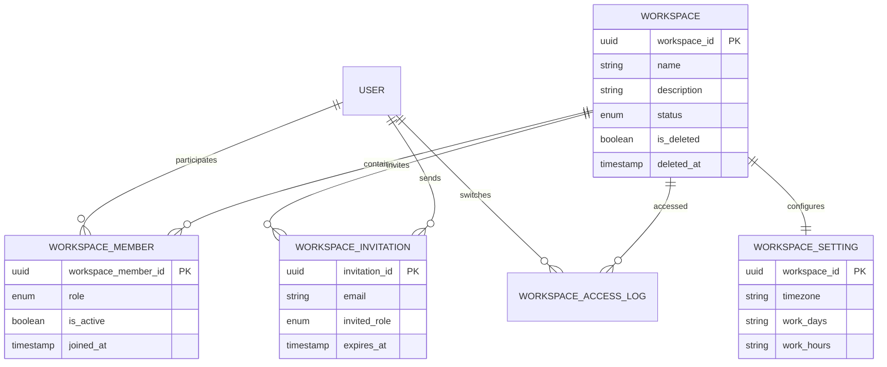

**Project**: PronaFlow 
**Version**: 1.0
**State**: Draft 
_**Last updated:** Jan 9, 2026_

---
# Relationship
## Quan hệ & Cardinality
- **User 1–N WorkspaceMember**
- **Workspace 1–N WorkspaceMember**
- **Workspace 1–N WorkspaceInvitation**
- **Workspace 1–1 WorkspaceSetting**
- **User 1–N WorkspaceInvitation (invited_by)**
- **User 1–N WorkspaceAccessLog**
# ERD
