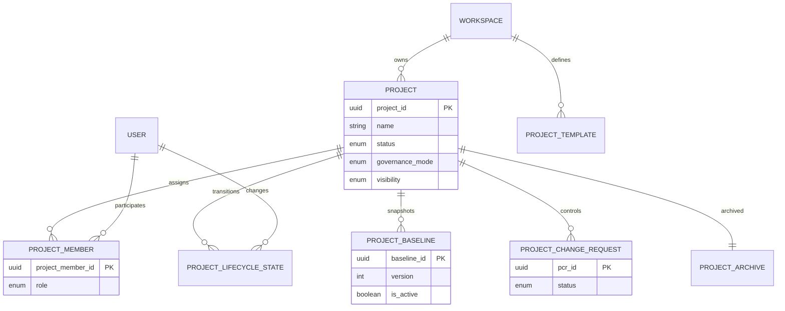

**Project**: PronaFlow 
**Version**: 1.0
**State**: Draft 
_**Last updated:** Jan 9, 2026_

---
## Quan hệ tổng thể (Cardinality)
- **Workspace 1–N Project**
- **Project 1–N ProjectMember**
- **User 1–N ProjectMember**
- **Project 1–N ProjectLifecycleState**
- **Project 1–N ProjectBaseline**
- **Project 1–N ProjectChangeRequest**
- **Workspace 1–N ProjectTemplate**
- **Project 0–1 ProjectArchive**

