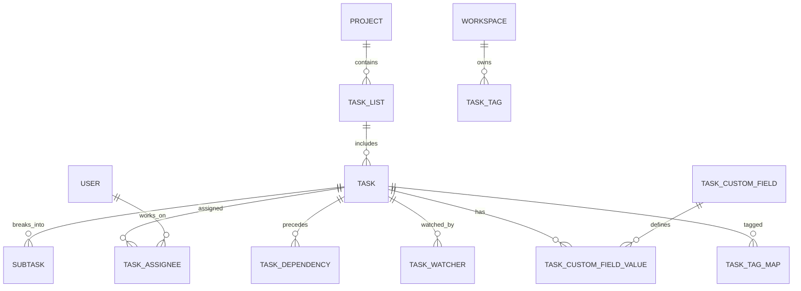

**Project**: PronaFlow 
**Version**: 1.0
**State**: Draft 
_**Last updated:** Jan 9, 2026_

---
## Quan hệ tổng thể
- **Project 1–N TaskList**
- **TaskList 1–N Task**
- **Task 1–N Subtask**
- **Task N–N User** (Assignee)
- **Task N–N Task** (Dependency)
- **Workspace 1–N TaskTag**
- **Task N–N TaskTag**
- **Project 1–N TaskCustomField**
- **Task 1–N TaskCustomFieldValue**

# ERD
