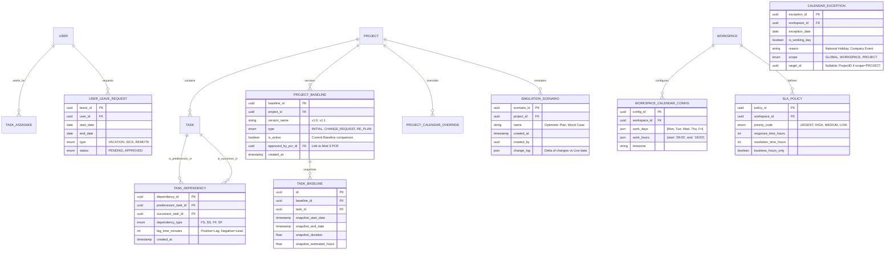

**Project**: PronaFlow 
**Version**: 1.0
**State**: Draft 
_**Last updated:** Jan 9, 2026_

---
# ERD

```mermaid
erDiagram
    %% Core References from other Modules
    PROJECT ||--o{ TASK : contains
    USER ||--o{ TASK_ASSIGNEE : works_on
    
    %% --- MODULE 5: DEPENDENCIES ---
    TASK ||--o{ TASK_DEPENDENCY : "is_predecessor_in"
    TASK ||--o{ TASK_DEPENDENCY : "is_successor_in"
    
    TASK_DEPENDENCY {
        uuid dependency_id PK
        uuid predecessor_task_id FK
        uuid successor_task_id FK
        enum dependency_type "FS, SS, FF, SF"
        int lag_time_minutes "Positive=Lag, Negative=Lead"
        timestamp created_at
    }

    %% --- MODULE 5: BASELINES (SNAPSHOTS) ---
    PROJECT ||--o{ PROJECT_BASELINE : versions
    PROJECT_BASELINE ||--o{ TASK_BASELINE : snapshots

    PROJECT_BASELINE {
        uuid baseline_id PK
        uuid project_id FK
        string version_name "v1.0, v1.1"
        enum type "INITIAL, CHANGE_REQUEST, RE_PLAN"
        boolean is_active "Current Baseline comparison"
        uuid approved_by_pcr_id FK "Link to Mod 3 PCR"
        timestamp created_at
    }

    TASK_BASELINE {
        uuid id PK
        uuid baseline_id FK
        uuid task_id FK
        timestamp snapshot_start_date
        timestamp snapshot_end_date
        float snapshot_duration
        float snapshot_estimated_hours
    }

    %% --- MODULE 5: CALENDARS & EXCEPTIONS ---
    %% Calendar Hierarchy: System -> Workspace -> Project -> User
    WORKSPACE ||--o{ WORKSPACE_CALENDAR_CONFIG : configures
    PROJECT ||--o{ PROJECT_CALENDAR_OVERRIDE : overrides
    USER ||--o{ USER_LEAVE_REQUEST : requests

    WORKSPACE_CALENDAR_CONFIG {
        uuid config_id PK
        uuid workspace_id FK
        json work_days "[Mon, Tue, Wed, Thu, Fri]"
        json work_hours "{start: '09:00', end: '18:00'}"
        string timezone
    }

    CALENDAR_EXCEPTION {
        uuid exception_id PK
        uuid workspace_id FK
        date exception_date
        boolean is_working_day
        string reason "National Holiday, Company Event"
        enum scope "GLOBAL, WORKSPACE, PROJECT"
        uuid target_id "Nullable: ProjectID if scope=PROJECT"
    }

    USER_LEAVE_REQUEST {
        uuid leave_id PK
        uuid user_id FK
        date start_date
        date end_date
        enum type "VACATION, SICK, REMOTE"
        enum status "PENDING, APPROVED"
    }

    %% --- MODULE 5: SLA & POLICIES ---
    WORKSPACE ||--o{ SLA_POLICY : defines
    SLA_POLICY {
        uuid policy_id PK
        uuid workspace_id FK
        enum priority_code "URGENT, HIGH, MEDIUM, LOW"
        int response_time_hours
        int resolution_time_hours
        boolean business_hours_only
    }

    %% --- MODULE 5: SIMULATION (WHAT-IF) ---
    PROJECT ||--o{ SIMULATION_SCENARIO : simulates
    
    SIMULATION_SCENARIO {
        uuid scenario_id PK
        uuid project_id FK
        string name "Optimistic Plan, Worst Case"
        timestamp created_at
        uuid created_by
        json change_log "Delta of changes vs Live data"
    }
```