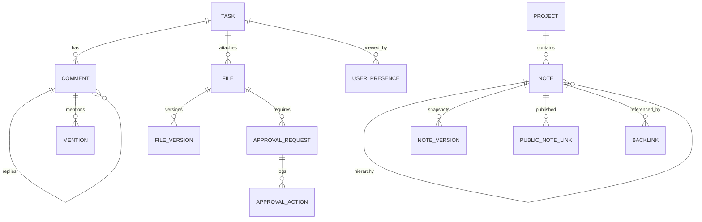

**Project**: PronaFlow 
**Version**: 1.0
**State**: Draft 
_**Last updated:** Jan 11, 2026_

---
# Entity
|Domain|Entity|
|---|---|
|Discussion|Comment, CommentThread, Mention|
|Digital Asset|File, FileVersion|
|Approval|ApprovalRequest, ApprovalAction|
|Presence|UserPresence|
|Notes / Wiki|Note, NoteVersion, NoteTemplate|
|Search / Link|Backlink|

# ERD
