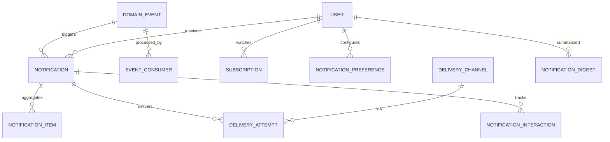

**Project**: PronaFlow 
**Version**: 1.0
**State**: Draft 
_**Last updated:** Jan 11, 2026_

---

>- Mục tiêu: **Right Person – Right Time – Right Channel**  
>- Kiến trúc: **Event → Filter → Aggregate → Route → Deliver → Track**

# Entity
|Nhóm|Entity|
|---|---|
|Event Core|DomainEvent, EventConsumer|
|Notification|Notification, NotificationItem|
|Preference|NotificationPreference, Subscription|
|Delivery|DeliveryChannel, DeliveryAttempt|
|Template|NotificationTemplate|
|Interaction|NotificationInteraction|
|Digest|NotificationDigest|
# ERD

# Mapping Functional into Entity
|Đặc tả|Entity|
|---|---|
|Debounce / Batching|NotificationItem|
|Presence routing|DeliveryChannel + UserPresence (Module 6)|
|Persistent vs Ephemeral|Notification vs WebSocket only|
|Watch / Unwatch|Subscription|
|Template đa ngữ|NotificationTemplate|
|Retry + Backoff|DeliveryAttempt|
|Idempotency|DomainEvent + EventConsumer|
|TTL|Notification.expires_at|