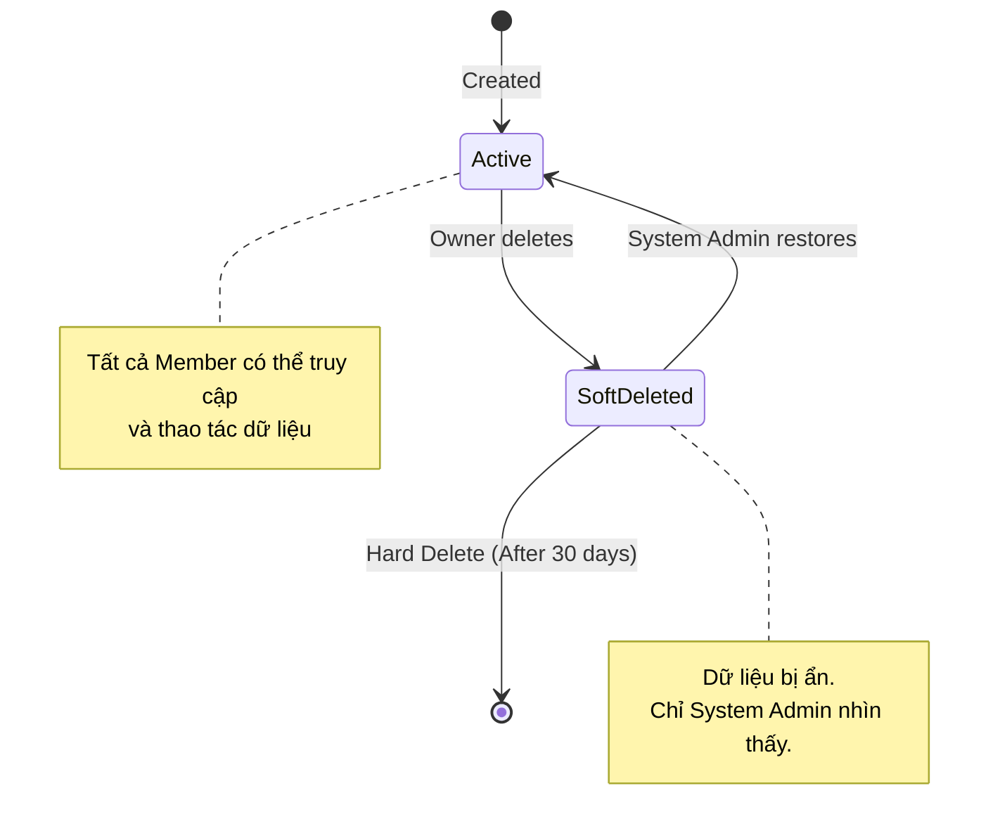

**Project**: PronaFlow 
**Version**: 1.1 
**State**: Ready for Review 
_**Last updated:** Jan 04, 2026_

---
# 1. Business Overview
Workspace (Không gian làm việc) là đơn vị tổ chức cấp cao nhất trong kiến trúc Multi-tenancy của PronaFlow. Mỗi Workspace hoạt động như một "container" độc lập, đảm bảo tính cô lập dữ liệu tuyệt đối (Logical Isolation). Mọi tài nguyên như Project (Dự án), Tasks (Công việc), Tags (Nhãn) và Members (Thành viên) đều thuộc phạm vi của một Workspace cụ thể.
Module này chịu trách nhiệm quản lý:
1. **Vòng đời Workspace:** Khởi tạo -> Hoạt động -> Lưu trữ/Xóa.
2. **Quản trị Thành viên:** Mời người dùng, phân quyền trong nội bộ tổ chức.
3. **Cấu hình Ngữ cảnh:** Thiết lập múi giờ, lịch làm việc áp dụng cho toàn bộ dự án con.
# 2. User Story & Acceptance Criteria
## 2.1. Feature: Workspace Creation
### User Story 2.1:
Là một Người dùng, Tôi muốn tạo một Workspace mới và đặt tên cho nó, Để phân tách các ngữ cảnh công việc khác nhau (ví dụ: Cá nhân, Công ty, Dự án Freelance) mà không bị lẫn lộn dữ liệu.
### Acceptance Criteria ( #AC)
#### AC 1 - Khởi tạo thành công:
- **Given:** Người dùng đang ở màn hình danh sách Workspace.
- **When:** Người dùng nhập `Workspace Name` (Bắt buộc, Max 50 ký tự), `Description` (Tùy chọn) và nhấn "Create".
- **Then:** 1. Hệ thống tạo bản ghi Workspace mới. 2. Gán Người dùng hiện tại là **Owner** (Chủ sở hữu). 3. Tự động chuyển ngữ cảnh (Switch Context) sang Workspace vừa tạo.
#### AC 2 - Default Workspace (Logic tự động)
- **Given:** Người dùng vừa hoàn tất đăng ký tài khoản mới (Register).
- **When:** Người dùng đăng nhập lần đầu tiên.
- **Then:** Hệ thống tự động tạo sẵn một Workspace mặc định tên là `"{Username}'s Workspace"` để người dùng bắt đầu làm việc ngay.
#### AC 3 - Validation:
- **When:** Người dùng nhập tên chỉ chứa ký tự đặc biệt hoặc từ ngữ cấm (Profanity Filter).
- **Then:** Hệ thống hiển thị lỗi `WS_001: Tên Không gian làm việc không hợp lệ`.
## 2.2. Feature: Chuyển đổi Ngữ cảnh (Context Switching)
### User Story 2.2:
Là một Người dùng tham gia nhiều Workspace, Tôi muốn chuyển đổi nhanh giữa các Workspace trên thanh điều hướng, Để truy cập vào dữ liệu dự án tương ứng với không gian đó.
### Acceptance Criteria (#AC)
#### AC 1 - Data Isolation (Cô lập dữ liệu)
- **Given:** Người dùng chuyển từ `Workspace A` sang `Workspace B`.
- **Then:** - Giao diện reload lại Dashboard.
 - Danh sách Projects, Notifications chỉ hiển thị dữ liệu của `Workspace B`.
 - Tuyệt đối không hiển thị dữ liệu của `Workspace A` (trừ phần User Profile chung).
#### AC 2 - State Persistence (Lưu trạng thái)
- **When:** Người dùng đăng xuất và đăng nhập lại vào ngày hôm sau.
- **Then:** Hệ thống đưa người dùng thẳng vào Workspace cuối cùng họ truy cập (`last_accessed_workspace_id`), thay vì bắt chọn lại từ đầu.
## 2.3. Feature: Member Invitation & Management (Quản lý Thành viên)
### User Story 2.5 (New)
Là một Workspace Owner, Tôi muốn mời đồng nghiệp tham gia vào Workspace qua email, Để chúng tôi có thể cùng cộng tác trên các dự án chung.
### Acceptance Criteria (#AC)
#### AC 1 - Invite Flow (Luồng mời)
- **Input:** Nhập danh sách Email (có thể nhập nhiều), chọn Vai trò mặc định (Member/Admin).
- **Logic:**
	 - Nếu Email đã có tài khoản PronaFlow: Gửi thông báo In-app + Email.
	 - Nếu Email chưa có tài khoản: Gửi Email chứa "Magic Link" để đăng ký tài khoản mới và tự động join Workspace sau khi đăng ký xong.
- **Token:** Link mời có hiệu lực trong 48 giờ.
#### AC 2 - Role Assignment (Gán vai trò)
1. Workspace Owner (Chủ sở hữu)
	- **Định nghĩa**: Người tạo ra Workspace hoặc được chuyển giao quyền lực. Đây là vai trò có quyền lực tối cao trong Workspace.
	- **Đặc quyền**: Nắm giữ quyền quyết định về tài chính (Billing), quản lý vòng đời tổ chức và quản lý các Admin khác
2. Workspace Admin (Quản trị viên)
	- **Định nghĩa**: Người hỗ trợ Owner vận hành tổ chức.
	- **Đặc quyền**: Quản lý thành viên, thiết lập cấu hình chung (ngày làm việc, lễ tết), tạo dự án mới. Tuy nhiên, Admin không được truy cập thông tin thanh toán hoặc xóa Worksapce.
3. Member (Thành viên)
	- **Định nghĩa**: Nhân viên hoặc cộng tác viên chính thức.
	- **Đặc quyền**: Có quyền truy cập và thao tác (tạo task, comment) trong các Dự án mà họ được gán. Không thể thay đổi cấu hình Workspace.
4. Viewer (Người xem / Khách)
	-  **Định nghĩa**: Stakeholder hoặc đối tác bên ngoài.
	- **Đặc quyền**: Chỉ có quyền xem (Read-only) các tài nguyên được chia sẻ cụ thể. Không thể điều chỉnh dữ liệu.
Ma trận phân quyền: [[#3. Business Rules & Constraints#3.1. Security & Permissions ( RBAC Matrix)|Permission Matrix: Workspace Permission Roles]]
#### AC 3 - Remove Member (Xóa thành viên)
- **Action:** Owner xóa một thành viên khỏi Workspace.
- **Result:**
	 - Thành viên đó mất quyền truy cập ngay lập tức.
	 - Các Task đang được gán cho họ chuyển về trạng thái `Unassigned` hoặc giữ nguyên (tùy cấu hình), nhưng tên hiển thị chuyển thành "Former Member".
## 2.4. Feature: Workspace Settings (Cấu hình Tổ chức)
### User Story 2.6 (New)
Là một Workspace Admin, Tôi muốn thiết lập ngày làm việc và ngày nghỉ lễ cho toàn bộ Workspace, Để các biểu đồ Gantt và tính toán SLA trong dự án con được chính xác.
### Acceptance Criteria (#AC)
#### AC 1 - Working Schedule
- Cho phép cấu hình:
	 - **Work Days:** Mon - Fri (Mặc định).
	 - **Work Hours:** 09:00 - 18:00.
	 - **Timezone:** Asia/Ho_Chi_Minh (GMT+7).
#### AC 2 - Branding (Tùy chọn)
- Cho phép upload Logo của công ty để thay thế Logo mặc định của Workspace trên thanh Sidebar (Tăng tính cá nhân hóa).
## 2.5. Feature: Lifecycle & Soft Delete
### User Story 2.3:
Là một Workspace Owner, Tôi muốn xóa một Workspace không còn sử dụng, Để dọn dẹp giao diện và quản lý tài nguyên hiệu quả.
### Acceptance Criteria (#AC)
#### AC 1 - Cảnh báo tác động (Impact Analysis)
- **When:** Owner nhấn "Delete Workspace".
- **Then:** Hệ thống hiển thị Modal cảnh báo: "Hành động này sẽ lưu trữ **X** Dự án và **Y** Task. Bạn có chắc chắn không?". Yêu cầu nhập đúng tên Workspace để xác nhận.
#### AC 2 - Soft Delete Logic
- **Action:** Xác nhận xóa.
- **System:** Update `is_deleted = true`, `deleted_at = NOW()`. Workspace biến mất khỏi danh sách truy cập của tất cả thành viên.
#### AC 3 - Permissions Guard
- Chỉ **Owner** mới có quyền xóa Workspace. Admin hay Member không nhìn thấy nút này.
## 2.6. Feature: System Admin Governance (Back-office)
### User Story 2.4:
Là một System Admin (Quản trị viên hệ thống), Tôi muốn xem danh sách Workspace đã bị xóa mềm và thực hiện khôi phục hoặc xóa vĩnh viễn, Để hỗ trợ người dùng hoặc giải phóng dung lượng Database.
### Acceptance Criteria (#AC)
#### AC 1 - Auto-Purge Policy
- **Automated Job:** Mỗi ngày lúc 00:00, hệ thống quét các Workspace có `is_deleted = true` VÀ `deleted_at > 30 days`.
- **Action:** Thực hiện **Hard Delete** (Xóa vĩnh viễn khỏi SQL).
#### AC 2 - Restore Capability
- Admin có thể tìm kiếm Workspace theo ID hoặc Tên, sau đó nhấn "Restore" để khôi phục quyền truy cập cho Owner cũ.
# 3. Business Rules & Constraints
## 3.1. Security & Permissions ( #RBAC Matrix)
| Permission Code    | Owner | Admin  | Member | Viewer | Mô tả                                        |
| ------------------ | ----- | ------ | ------ | ------ | -------------------------------------------- |
| Quản trị Tổ chức   |       |        |        |        |                                              |
| `WS.UPDATE`        | ✅     | ✅      | ❌      | ❌      | Sửa tên, Logo, Cấu hình Timezone             |
| `WS.DELETE`        | ✅     | ❌      | ❌      | ❌      | Xóa mềm Workspace                            |
| `WS.BILLING`       | ✅     | ❌      | ❌      | ❌      | Quản lý gói cước thanh toán (Module 13)      |
| Quản trị Nhân sự   |       |        |        |        |                                              |
| `WS.MEMBER.INVITE` | ✅     | ✅      | ❌      | ❌      | Mời thành viên mới                           |
| `WS.MEMBER.UPDATE` | ✅     | ✅      | ❌      | ❌      | Thay đổi vai trò thành viên (Promote/Demote) |
| `WS.MEMBER.KICK`   | ✅     | ✅(*)   | ❌      | ❌      | Xóa thành viên (Admin không xóa được Owner)  |
| Quản trị Dự án     |       |        |        |        |                                              |
| `PROJ.CREATE`      | ✅     | ✅      | ❌      | ❌      | Tạo dự án mới                                |
| `PROJ.ACCESS_ALL`  | ✅     | ❌ (**) | ❌      | ❌      | Truy cập tất cả dự án (Kể cả Private)        |
**Ghi chú:**
- `(*)` **Admin** không thể xóa (Kick) hoặc hạ quyền (Demote) **Owner**.
- `(**)` **Admin** không mặc định nhìn thấy các dự án Private trừ khi họ được mời vào dự án đó hoặc họ là người tạo ra nó.
## 3.2. Data Integrity Rules (Quy tắc Toàn vẹn Dữ liệu)
1. **Isolation Query Rule:** Mọi câu truy vấn dữ liệu (Projects, Tasks, Tags) đều **BẮT BUỘC** phải có điều kiện `WHERE workspace_id = :current_ws_id`. Tuyệt đối không cho phép truy vấn dữ liệu "Global" (trừ System Admin).
2. **Cascade Logic:** Khi Workspace bị xóa (Soft Delete), không cần update trạng thái `is_deleted` cho hàng nghìn Project/Task con ngay lập tức (gây lock table). Logic lọc sẽ nằm ở tầng Application (Nếu Parent deleted -> Children hidden).
3. **Owner Succession (Kế thừa quyền lực):**
	 - Mỗi Workspace phải luôn có **ít nhất 1 Owner**.
	 - Owner không thể rời khỏi (Leave) Workspace nếu họ là Owner duy nhất. Họ bắt buộc phải chuyển giao quyền lực (Transfer Ownership) cho một thành viên khác trước khi rời đi hoặc xóa Workspace.
4. **Unique Constraints (Ràng buộc duy nhất):**
	 - Một User không thể tham gia 2 lần vào cùng 1 Workspace.
	 - ID của Workspace (UUID) là duy nhất toàn cục hệ thống
## 3.3. Các quy tắc trong hệ thống phân quyền Workspace.
1. **Quy tắc Kế thừa Quyền lực (Owner Succession):**
    - Mỗi Workspace bắt buộc phải luôn có **ít nhất 01 Owner**.
    - Owner hiện tại không thể rời khỏi (Leave) Workspace nếu họ là Owner duy nhất. Hệ thống buộc họ phải chuyển giao quyền lực (Transfer Ownership) cho một thành viên khác trước khi rời đi.
2. **Quy tắc Cô lập Dữ liệu (Isolation Rule):**
    - Thành viên của Workspace A **tuyệt đối không** thể nhìn thấy dữ liệu của Workspace B, ngay cả khi họ có tài khoản ở cả hai nơi. Việc chuyển đổi giữa các Workspace phải tải lại ngữ cảnh (Context Switching).
3. **Quy tắc Bảo vệ Thanh toán (Billing Protection):**
    - Chỉ **Owner** mới có quyền truy cập vào Module 13 (Subscription & Billing). Điều này ngăn chặn rủi ro Admin lạm quyền nâng cấp gói cước gây phát sinh chi phí cho doanh nghiệp.
# 4. Theoretical Basis (Cơ sở Lý luận)
## 4.1. Kiến trúc Multi-tenancy: Shared Database, Shared Schema
PronaFlow sử dụng chiến lược **Logical Isolation** (Cô lập logic).
- **Lý do:** Tiết kiệm chi phí hạ tầng và dễ dàng bảo trì schema (so với việc mỗi khách hàng 1 Database riêng).
- **Rủi ro:** Lộ lọt dữ liệu giữa các Tenant (Data Leakage).
- **Giải pháp:** Áp dụng **Row-Level Security (RLS)** ở tầng Database (PostgreSQL Policies) hoặc Middleware filter chặt chẽ ở tầng Backend Service.
## 4.2. Workspace State Machine (Máy trạng thái)

