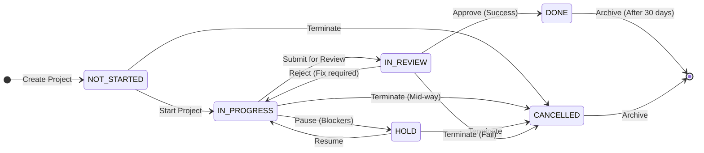
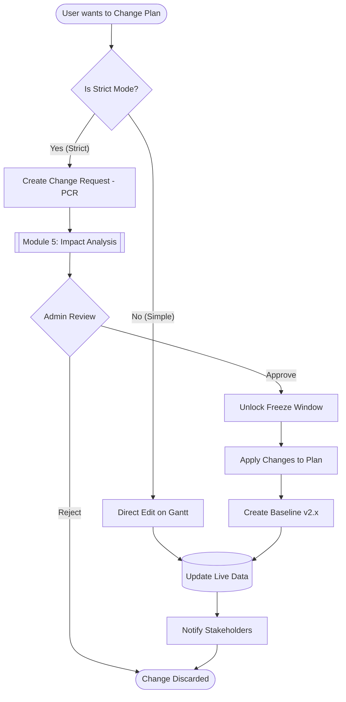
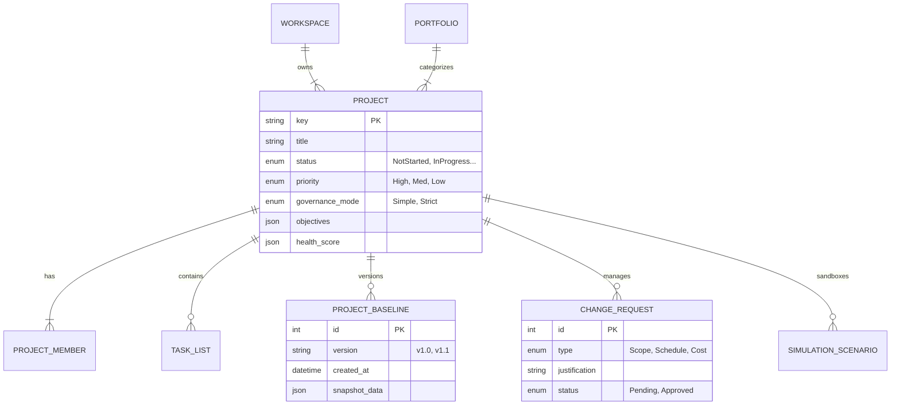
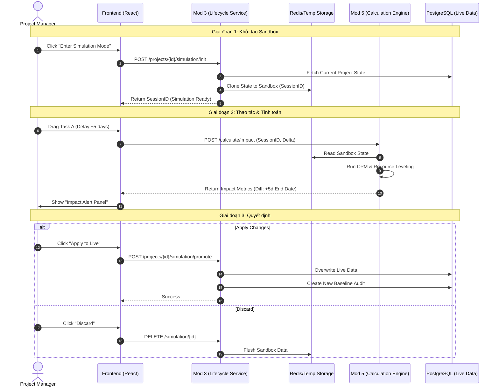
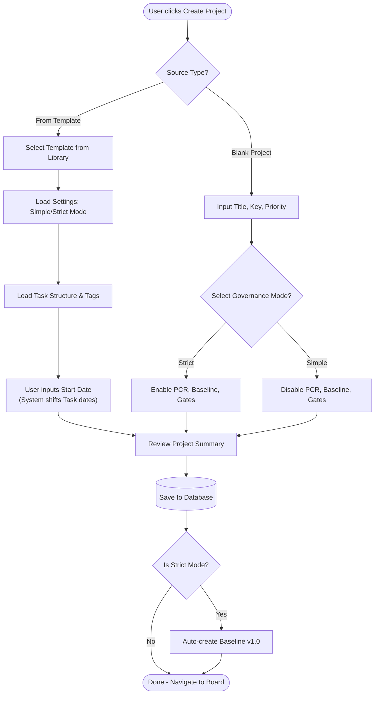

**Project**: PronaFlow 
**Version**: 1.1 
**State**: Ready for Review 
_**Last updated:** Jan 04, 2026_

---
# 1. Business Overview
**Project (Dự án)** là thực thể trung tâm nơi diễn ra sự cộng tác. Trong PronaFlow, một dự án không chỉ là tập hợp các công việc (Tasks) mà là một quy trình khép kín có Vòng đời (Lifecycle) rõ ràng, từ lúc khởi tạo, thực thi đến khi đóng lại.
Module này chịu trách nhiệm:
1. **Quản trị Meta-data:** Tên, mô tả, thời gian, ngân sách (nếu có).
2. **Quản trị Thành viên Dự án:** Ai được quyền truy cập và vai trò của họ là gì.
3. **Kiểm soát Vòng đời:** Điều phối trạng thái dự án thông qua Máy trạng thái (State Machine).
# 2. User Stories & Acceptance Criteria
## 2.1. Feature: Quản lý Thông tin Dự án (CRUD Project)
### User Story 2.1
Là một Thành viên Workspace, Tôi muốn tạo một dự án mới, Để bắt đầu tổ chức công việc cho một mục tiêu cụ thể.
### Acceptance Criteria (#AC)
#### AC 1 - Create Project Validation
- **Input:** `Title` (Required, Max 150 chars), `Description` (Optional), `Key` (Tự động sinh: PROJ-1, PROJ-2), `Start Date`, `End Date`.
- **Logic:**
	 - `Title` không được chỉ chứa khoảng trắng.
	 - Nếu nhập `End Date`, hệ thống bắt buộc `End Date >= Start Date`.
- **Default State:** Dự án tạo xong có trạng thái mặc định là **Not-Started**.
- **Owner Assignment:** Người tạo dự án tự động trở thành **Project Manager** (Quyền cao nhất trong dự án).
#### AC 2 - Update Metadata
- Chỉ **Project Manager** hoặc **Workspace Admin** mới có quyền chỉnh sửa tên, mô tả.
- Hệ thống ghi log lại người sửa và thời gian sửa (`updated_at`, `updated_by`).
#### AC 3 - Project Cloning (Nhân bản dự án) - _New_
- **Action:** Cho phép chọn "Duplicate Project".
- **Option:** Người dùng có thể chọn:
	 - [x] Copy cấu trúc (Task Lists, Settings).
	 - [ ] Copy Tasks (Thường là không chọn để tránh rác).
	 - [ ] Copy Members.
- **Result:** Tạo ra dự án mới có tên "Copy of [Old Name]".
## 2.2. Feature: Quản lý Trạng thái Dự án (Lifecycle Management)
### User Story 2.2
Là một Project Manager, Tôi muốn thay đổi trạng thái của dự án theo quy trình chuẩn, Để báo cáo chính xác giai đoạn thực hiện trên Dashboard.
### Acceptance Criteria (#AC)
#### AC 1 - 5 Global Statuses
Hệ thống quy định cứng (Hard-coded) 5 trạng thái:

| **ID** | **Status Code** | **Display Name (VN)** | **Color Hex** | **Ý nghĩa Nghiệp vụ**                            |
| ------ | --------------- | --------------------- | ------------- | ------------------------------------------------ |
| 0      | `HOLD`          | Tạm dừng              | `#64748B`     | Dự án bị đóng băng, không cho phép tạo Task mới. |
| 1      | `NOT_STARTED`   | Chưa bắt đầu          | `#94A3B8`     | Giai đoạn lập kế hoạch (Default).                |
| 2      | `IN_PROGRESS`   | Đang thực hiện        | `#3B82F6`     | Giai đoạn thực thi chính. Active.                |
| 3      | `IN_REVIEW`     | Đang đánh giá         | `#F59E0B`     | Giai đoạn nghiệm thu, UAT.                       |
| 4      | `DONE`          | Hoàn thành            | `#10B981`     | Dự án kết thúc thành công. Read-only.            |
| **5**  | **`CANCELLED`** | **Đã hủy**            | **`#EF4444`** | **Dự án bị chấm dứt trước hạn. Read-only.**      |
#### AC 2 - State Transition Logic
- **Trigger:** Thay đổi dropdown trạng thái hoặc Kéo thả thẻ dự án ở màn hình "All Projects".
- **Impact:**
	 - Khi chuyển sang **Done** hoặc **Hold**: Hệ thống hiển thị Confirm Modal: "Việc này có thể hạn chế quyền chỉnh sửa của thành viên. Tiếp tục?".
#### AC 3 - Cancellation Logic (Logic Hủy dự án)
- **Action:** Khi người dùng chọn trạng thái **CANCELLED**.
- **Mandatory Input:** Hệ thống hiển thị Modal yêu cầu nhập **"Cancellation Reason"** (Lý do hủy).
    - _Dropdown:_ Thay đổi chiến lược, Hết ngân sách, Rủi ro kỹ thuật, Khác.
    - _Text:_ Ghi chú chi tiết.
- **DoD Bypass:** Khác với trạng thái `DONE` (phải đi qua cổng kiểm tra "Definition of Done" - Feature 2.8), trạng thái `CANCELLED` **bỏ qua** mọi kiểm tra về Task chưa hoàn thành. Hệ thống sẽ tự động đóng băng tất cả các Task còn dang dở.
- **Audit:** Lưu lý do hủy vào lịch sử dự án để phục vụ phân tích "Tỷ lệ thất bại" (Failure Rate) sau này.
## 2.3. Feature: Quản lý Thành viên Dự án (Project Members) - _New_
### User Story 2.4
Là một Project Manager, Tôi muốn thêm thành viên vào dự án và phân vai trò cụ thể, Để kiểm soát ai có thể xem hoặc chỉnh sửa dữ liệu.
### Acceptance Criteria (#AC)
#### AC 1 - Add Member
- **Condition:** Chỉ thêm được những người ĐÃ là thành viên của Workspace (kết quả từ Module 2).
- **Notification:** Gửi thông báo cho người được thêm: "Bạn đã được thêm vào dự án X".
#### AC 2 - Project Roles (Vai trò cục bộ)
Khác với vai trò trong Workspace, vai trò trong dự án quy định quyền hạn cụ thể hơn. Hệ thống định nghĩa 4 vai trò cốt lõi để đáp ứng cả nhu cầu quản lý linh hoạt lẫn kiểm soát chặt chẽ:
1. **Project Manager** ( #PM - Quản trị dự án)
	- **Định nghĩa**: Người chịu trách nhiệm cao nhất về sự thành bại của dự án. Là người tạo ra dự án.
	- **Đặc quyền**: Toàn quyền cấu hình dự án, phê duyệt kế hoạch (Baseline), quản lý thành viên và quyết định các thay đổi phạm vi (Scope).
2. **Planner** (Người hoạch định): (Vai trò đặc thù cho Module 5) [[5 - Temporal Planning and Scheduling]]
	- **Định nghĩa**: Người hỗ trợ #PM trong việc xây dựng lịch trình. Thường là Team Leader hoặc Scheduler chuyên nghiệp.
	- **Đặc quyền**: Có quyền chỉnh sửa biểu đồ Gantt, thiết lập các mối quan hệ phụ thuộc (Dependencies), đề xuất Baseline mới. Tuy nhiên, họ _**không**_ có quyền xóa dự án hoặc thay đổi các thiết lập quảnn trị (Billing, Governannce Mode).
3. **Member** (Thành viên thực thi):
	- **Định nghĩa**: Các nhân sự trực tiếp làm việc (Dev, Designer, Tester, ...)
	- **Đặc quyền**: Tập trung vào thực thi (Execution). Có quyền cập nhật trạng thái Task, log thời gian (Timesheet), comment, upload file. **Hạn chế:** Không được tự ý thay đổi ngày bắt đầu/kết thúc của Task nếu dự án đang bị khóa kế hoạch (Locked Plan).
4. **Viewer** (Người quan sát / Stakeholder):
	- **Định nghĩa**: Khách hàng hoặc quản lý cấp cao muốn theo dõi tiến độ.
	- **Đặc quyền**: Chỉ xem (Read-only) báo cáo, tiến độ và tài liệu. Không được tương tác ghi (Writer).
> Ma trận phân quyền chi tiết: [[#3. Business Rules#3.21. Ma trận Phân quyền Chi tiết (Permission Matrix) |Permission Matrix: Project Permission Rules]]
## 2.4. Feature: Thiết lập Quyền Riêng tư (Privacy Settings)
### User Story 2.3
Là một Chủ dự án, Tôi muốn thiết lập dự án là Riêng tư (Private), Để bảo mật thông tin nhạy cảm khỏi các thành viên khác trong cùng Workspace.
### Acceptance Criteria (#AC)
#### AC 1 - Visibility Logic
- **Public:** Tất cả thành viên Workspace đều thấy dự án này trên bảng chung và có thể tự tham gia (Join).
- **Private:**
	 - Dự án bị ẩn hoàn toàn với người không phải thành viên.
	 - Chỉ những người được mời (Invited) mới truy cập được.
## 2.5. Feature: Soft Delete & Restore
### Acceptance Criteria (#AC)
#### AC 1 - Soft Delete
- **Action:** PM chọn "Move to Trash".
- **System:** Update `is_deleted = 1`. Dự án biến mất khỏi các danh sách Active.
- **Reference:** Các Task thuộc dự án này cũng bị ẩn theo (Query Filter), nhưng không bị update trong DB ngay lập tức (Lazy Update).
#### AC 2 - Hard Delete Constraint
- Dự án trong thùng rác quá 30 ngày sẽ bị xóa vĩnh viễn bởi Cronjob (Theo quy định tại Module 8).
## 2.6. Feature: Project Templates (Mẫu Dự án)
### User Story 3.6
Là một PMO (Project Management Officer), Tôi muốn tạo các mẫu dự án chuẩn (ví dụ: "Quy trình Phần mềm", "Chiến dịch Marketing") bao gồm sẵn danh sách công việc mẫu và cấu hình, Để các PM không phải thiết lập lại từ đầu và đảm bảo tuân thủ quy trình công ty.
### Acceptance Criteria ( #AC)
#### AC 1 - Template Scope
- Khi lưu một Dự án thành Template, hệ thống lưu lại:
    - Cấu trúc **Task Lists** (Phases).
    - Các **Tasks/Subtasks** mẫu (bao gồm Mô tả, Checklist, Tags).
    - Cấu hình **Project Settings** (Workflow, Custom Fields).
    - _Không lưu:_ Thành viên cụ thể và Ngày tháng cụ thể (Dates).
#### AC 2 - Project Initialization from Template
- **Action:** Khi tạo dự án mới, User chọn "Use a Template".
- **Logic:** Hệ thống clone toàn bộ cấu trúc từ Template sang Dự án mới.
- **Date Remapping:** Hệ thống hỏi "Ngày bắt đầu dự án mới?", sau đó tự động tịnh tiến (Shift) ngày của các Task mẫu dựa trên khoảng cách tương đối (Relative Duration) so với ngày bắt đầu.
## 2.7. Feature: Project Categories & Portfolios (Phân loại & Danh mục)

### User Story 3.7
Là một Giám đốc Khối, Tôi muốn gom nhóm các dự án liên quan thành một "Chương trình" (Program) hoặc "Danh mục" (Portfolio), Để theo dõi sức khỏe tổng thể của cả nhóm dự án thay vì xem lẻ tẻ.
### Acceptance Criteria ( #AC)
#### AC 1 - Categorization
- Cho phép gắn **Category** (Ví dụ: "Internal", "Client A", "R&D") cho dự án.
- Cho phép gắn **Portfolio Tag** (Ví dụ: "Chiến lược 2025").
- Các nhãn này dùng để lọc (Filter) và gom nhóm (Group By) trên Dashboard tổng hợp (Module 11).
#### AC 2 - Hierarchy Support (Hỗ trợ Module 5)
- Việc phân loại này là cơ sở dữ liệu để Phân hệ 5 thực hiện tính năng **"Cross-Project Dependencies"** (Chỉ cho phép nối dependency giữa các dự án trong cùng Portfolio nếu cấu hình hạn chế).
## 2.8. Feature: Status Transition Gates (Cổng kiểm soát trạng thái)
### User Story 3.8
Là một Quản trị viên, Tôi muốn thiết lập các điều kiện bắt buộc trước khi dự án được phép chuyển trạng thái, Để ngăn chặn sai sót quy trình (ví dụ: Đóng dự án khi vẫn còn việc đang làm).
### Acceptance Criteria ( #AC)
#### AC 1 - "Definition of Done" Gate
- **Condition:** Khi User chuyển trạng thái Project sang **DONE**.
- **Check:** Hệ thống kiểm tra xem còn Task nào có trạng thái `!= DONE` không.
- **Action:**
    - Nếu còn: Hiển thị Modal liệt kê các Task chưa xong và yêu cầu xác nhận: _"Hủy bỏ (Cancel) các task này"_ hay _"Di chuyển (Move) sang dự án khác"_.
#### AC 2 - "Planning Approval" Gate (Integration with Module 5)
- **Condition:** Khi chuyển sang **IN_PROGRESS**.
- **Check:** Kiểm tra xem Dự án đã có **Baseline** nào được phê duyệt chưa (nếu bật chế độ Strict Governance).
## 2.9. Feature: Project Objectives & Success Criteria (Mục tiêu & Tiêu chí Thành công)
### User Story 3.9
Là một Stakeholder, Tôi muốn định nghĩa rõ ràng mục tiêu và các tiêu chí đánh giá thành công ngay từ đầu, Để đảm bảo dự án không chỉ hoàn thành về mặt kỹ thuật ("Done") mà còn đạt được giá trị kinh doanh mong đợi ("Success").
### Acceptance Criteria (#AC)
#### AC 1 - Definition Input
- Trong tab "Overview", cho phép PM khai báo:
 - **Objectives:** Mục tiêu định tính (Text/Rich Text). Ví dụ: "Nâng cao trải nghiệm người dùng".
 - **Success Criteria (KPIs):** Danh sách các tiêu chí định lượng (Checklist). Ví dụ: "Tăng conversion rate lên 5%", "Giảm thời gian load trang < 2s".
#### AC 2 - Evaluation at Closure
- **Trigger:** Khi chuyển trạng thái dự án sang **DONE**.
- **Action:** Hệ thống hiển thị bảng đánh giá (Scorecard) yêu cầu PM tự chấm điểm từng tiêu chí:
 - _Met (Đạt)_ / _Partially Met (Đạt một phần)_ / _Missed (Không đạt)_.
- **Audit:** Kết quả đánh giá này được lưu vĩnh viễn vào hồ sơ dự án để phục vụ báo cáo tổng kết.
## 2.10. Feature: Project Health Indicators (Chỉ báo Sức khỏe Dự án)
### User Story 3.10
Là một Portfolio Manager, Tôi muốn nhìn thấy trạng thái sức khỏe của dự án qua hệ thống đèn giao thông (Xanh/Vàng/Đỏ), Để kịp thời can thiệp vào các dự án đang gặp rủi ro mà không cần đọc báo cáo chi tiết.
### Acceptance Criteria ( #AC)
#### AC 1 - Auto-Calculated Health
- Hệ thống tự động tính toán 3 chỉ số thành phần:
 1. **Schedule Health:** Dựa trên số lượng Task quá hạn hoặc chỉ số SPI (từ Module 11).
 2. **Resource Health:** Dựa trên số giờ làm việc quá tải (Overload) của thành viên.
 3. **Budget Health:** Dựa trên chi phí thực tế so với ngân sách (nếu có).
#### AC 2 - Overall Traffic Light
- Tổng hợp thành trạng thái chung:
 - 🟢 **Green (On Track):** Mọi chỉ số đều ổn.
 - 🟡 **Amber (At Risk):** Có 1 chỉ số cảnh báo (ví dụ: Trễ < 10%).
 - 🔴 **Red (Off Track):** Có chỉ số nguy hiểm (ví dụ: Trễ > 10% hoặc Over budget).
#### AC 3 - Manual Override with Context
- PM có quyền ghi đè trạng thái (ví dụ: Hệ thống báo Đỏ nhưng PM biết là kiểm soát được -> Chỉnh về Vàng).
- **Constraint:** Bắt buộc nhập "Lý do/Giải trình" khi ghi đè thủ công.
## 2.11. Feature: Project Change Request - PCR (Yêu cầu Thay đổi Dự án)
### User Story 3.11
Là một PM, Tôi muốn tạo yêu cầu thay đổi khi có phát sinh về phạm vi hoặc thời gian, Để hợp thức hóa các thay đổi so với kế hoạch ban đầu (Baseline) thay vì sửa đổi tùy tiện.
### Acceptance Criteria ( #AC)
#### AC 1 - PCR Creation
- **Action:** Tạo mới Change Request (CR).
- **Type:** Chọn loại thay đổi: _Scope_ (Phạm vi), _Schedule_ (Lịch trình), _Cost_ (Chi phí), hoặc _Resource_.
- **Impact Link:** Tích hợp với **Module 5 (CIA Panel)** để đính kèm kết quả phân tích tác động (Ví dụ: "Dời deadline 5 ngày sẽ làm tăng chi phí 10%").
#### AC 2 - Approval Workflow
- **Flow:** `Draft` -> `Submitted` -> `Approved` / `Rejected`.
- **Approver:** Chỉ những người có vai trò **Steering Committee** hoặc **Workspace Admin** mới có quyền duyệt CR.
#### AC 3 - Post-Approval Action
- Khi CR được **Approved**:
 - Hệ thống tự động mở khóa (Unlock) các ràng buộc trong Module 5 để PM cập nhật lại kế hoạch.
 - Hệ thống yêu cầu lưu một **Baseline mới** ngay sau khi cập nhật xong.
## 2.12. Feature: Project Closure & Lessons Learned (Đóng Dự án & Bài học kinh nghiệm)
### User Story 3.12
Là một PMO, Tôi muốn thu thập các bài học kinh nghiệm và rủi ro chính khi đóng dự án, Để làm giàu kho tri thức (Knowledge Base) và tránh lặp lại sai lầm trong các dự án sau.
### Acceptance Criteria ( #AC)
#### AC 1 - Closure Wizard
- Khi chuyển trạng thái sang **DONE**, hiển thị Wizard "Project Closure":
 1. Bước 1: Đánh giá Mục tiêu (Feature 2.9).
 2. Bước 2: Giải phóng nguồn lực (Release Resources).
 3. Bước 3: Nhập **Lessons Learned** (Cái gì làm tốt? Cái gì cần cải thiện?).
 4. Bước 4: Xác nhận Lưu trữ (Archive).
#### AC 2 - Knowledge Recycling
- Dữ liệu "Lessons Learned" và "Key Risks" sẽ được gợi ý hiển thị khi một PM khác tạo dự án mới có cùng **Category** (Tính năng tích hợp với Module 15 - Knowledge Base).
## 2.13. Feature: Project Baseline Governance (Quản trị Đường cơ sở Dự án)
### User Story 3.13
Là một PMO hoặc Quản lý Chất lượng (QA), Tôi muốn kiểm soát chặt chẽ việc tạo và thay đổi các phiên bản Baseline (Đường cơ sở), Để đảm bảo sự thay đổi kế hoạch luôn được ghi nhận minh bạch và có lý do chính đáng (Tránh việc PM sửa kế hoạch âm thầm để che giấu sự chậm trễ).
### Acceptance Criteria ( #AC)
#### AC 1 - Versioning Strategy (Chiến lược Phiên bản)
- **Logic:** Hệ thống tự động quản lý phiên bản Baseline theo quy tắc tăng tiến:
    - **v1.0 (Initial):** Được tạo tự động khi Dự án chuyển trạng thái từ _Not-Started_ sang _In-Progress_ (hoặc khi được Phê duyệt lần đầu).
    - **v1.x (Minor):** Các thay đổi nhỏ, điều chỉnh nội bộ (nếu cấu hình cho phép).
    - **v2.0 (Major):** Được tạo khi có một **Change Request (PCR)** lớn được duyệt (liên kết với Feature 2.11).
- **Display:** Hiển thị rõ danh sách các phiên bản: _Version - Date - Created By - Context_.
#### AC 2 - Creation Conditions (Điều kiện khởi tạo)
- **Constraint:** Nút "Save Baseline" bị khóa (Disabled) nếu:
    - Dự án đang ở trạng thái _Hold_ hoặc _Done_.
    - Có các Task chưa được lập lịch (Missing Start/End Date).
    - (Tùy chọn) Chưa được phê duyệt bởi cấp trên (Integration với Module 5 Approval).
#### AC 3 - Modification Constraints (Ràng buộc chỉnh sửa)
- **Rule:** Một khi đã có Baseline Active (v1.0 trở lên):
    - Mọi hành động thay đổi ngày tháng (Reschedule) trên Gantt Chart đều kích hoạt một popup **"Change Context"**.
    - **Input bắt buộc:** Người dùng phải chọn _Reason Code_ (ví dụ: "Scope Creep", "Resource unavailable", "Estimation Error") và nhập chú thích trước khi hệ thống cho phép Lưu.
## 2.14. Feature: What-if Simulation & Scenario Planning (Mô phỏng & Lập kế hoạch Kịch bản)
### User Story 3.14
Là một Project Manager, Tôi muốn tạo các kịch bản mô phỏng (ví dụ: "Nếu team Backend nghỉ 3 ngày", "Nếu thêm 2 nhân sự") và xem trước tác động của chúng mà không làm ảnh hưởng đến dữ liệu dự án thực tế, Để tôi có thể ra quyết định chính xác nhất.
### Acceptance Criteria ( #AC)
#### AC 1 - Simulation Sandbox (Hộp cát mô phỏng)
- **Action:** Tại màn hình dự án, user chọn "Enter Simulation Mode".
- **System Behavior:**
    - Hệ thống tạo một bản sao tạm thời (Temporary Snapshot) của dự án hiện tại trong bộ nhớ (hoặc bảng tạm).
    - Giao diện chuyển sang tông màu khác (ví dụ: Viền vàng/Watermark "SIMULATION") để phân biệt với dữ liệu thật.
    - Tại đây, PM được phép thoải mái thay đổi Date, Dependency, Resource.
#### AC 2 - Scenario Management (Quản lý Kịch bản)
- Cho phép lưu các phiên bản mô phỏng thành các Kịch bản có tên (Named Scenarios).
    - _Ví dụ:_ Scenario A: "Optimistic Plan" (Kế hoạch lạc quan).
    - _Ví dụ:_ Scenario B: "Worst Case" (Trường hợp xấu nhất).
- Các kịch bản này chỉ hiển thị với PM và không ảnh hưởng đến Task list của thành viên (Integration with Module 4).
#### AC 3 - Impact Preview (Xem trước tác động - Integration with Module 5)
- Trước khi quyết định áp dụng, hệ thống hiển thị bảng so sánh **Diff** giữa _Simulation_ và _Live Project_:
    - **Delta Date:** Dự án sẽ xong sớm/trễ bao nhiêu ngày?
    - **Delta Cost:** Chi phí thay đổi thế nào?
    - **Risk:** Có bao nhiêu Task mới bị rơi vào đường găng (Critical Path)?
#### AC 4 - Promote to Execution (Áp dụng vào thực tế)
- **Action:** User chọn "Apply Scenario to Live Project".
- **Validation:**
    - Nếu dự án đang ở chế độ Strict Governance: Hệ thống tự động chuyển Kịch bản này thành một **Change Request (PCR)** (liên kết Feature 2.11) để chờ duyệt.
    - Nếu dự án bình thường: Cập nhật dữ liệu thật và tạo **Baseline** mới (nếu cấu hình yêu cầu).
## 2.15. Feature: Planning Scope Governance (Quản trị Phạm vi Hoạch định)
### User Story 3.15
Là một Project Manager, Tôi muốn định nghĩa rõ ràng những đầu việc nào tham gia vào tính toán kế hoạch (Planning) và những đầu việc nào chỉ mang tính chất theo dõi thực thi (Tracking), Để biểu đồ Gantt và đường găng (Critical Path) không bị nhiễu bởi các công việc vụn vặt.
### Acceptance Criteria ( #AC)
#### AC 1 - Planning Depth Configuration (Cấu hình Độ sâu Hoạch định)
- **Input:** Trong Project Settings, PM có thể thiết lập "Planning Cut-off Level":
    - **Level 1 (Phase):** Chỉ tính toán lịch trình cho các Phase lớn.
    - **Level 2 (Task List):** Tính toán đến cấp Task List.
    - **All Levels (Default):** Tính toán chi tiết đến từng Task.
- **Impact:** Các Task nằm sâu hơn mức Cut-off sẽ tự động có cờ `Is_Planning_Item = False`.
#### AC 2 - Explicit Inclusion/Exclusion (Chỉ định Phạm vi)
- Cho phép PM đánh dấu thủ công một Task List hoặc Task cụ thể là **"Execution Only"** (Chỉ thực thi).
- **Behavior:**
    - Các Task này vẫn hiện trên Board/List để làm việc.
    - Nhưng trên Gantt Chart (Module 5), chúng bị mờ đi hoặc ẩn (tùy view) và **không tham gia vào thuật toán CPM** (Critical Path Method).
    - Sự chậm trễ của các Task này **không** tự động đẩy lùi ngày kết thúc của Dự án (trừ khi PM đổi lại cấu hình).
#### AC 3 - Default Policy by Template
- Khi tạo dự án từ Template (Feature 2.6), cấu hình Planning Scope cũng được kế thừa. Ví dụ: Template "Agile" mặc định chỉ plan ở mức Epic (Level 1), để Dev tự do quản lý Task con.
## 2.16. Feature: Advanced Dependency Configuration (Cấu hình Phụ thuộc Nâng cao)
### User Story 3.16
Là một Planner/Scheduler chuyên nghiệp, Tôi muốn thiết lập dự án sử dụng mô hình phụ thuộc nâng cao (PDM) bao gồm các quan hệ song song và gối đầu, Để mô phỏng chính xác thực tế thi công (ví dụ: "Vừa xây vừa trát") thay vì chỉ xếp hàng tuần tự cứng nhắc.
### Acceptance Criteria ( #AC)
#### AC 1 - Supported Dependency Types (Các loại phụ thuộc)
- Trong cấu hình dự án, cho phép kích hoạt bộ 4 loại quan hệ chuẩn PDM:
    1. **FS (Finish-to-Start):** Mặc định. Task A xong thì Task B mới bắt đầu.
    2. **SS (Start-to-Start):** Task B bắt đầu cùng lúc (hoặc sau một khoảng) với khi Task A bắt đầu. _(Dùng cho công việc song song)_.
    3. **FF (Finish-to-Finish):** Task B chỉ được kết thúc khi Task A đã kết thúc. _(Dùng cho công việc nghiệm thu/kiểm thử)_.
    4. **SF (Start-to-Finish):** Task A bắt đầu là điều kiện để Task B kết thúc. _(Ít dùng, dành cho quản lý ca kíp/kho bãi)_.
#### AC 2 - Lead & Lag Time (Độ trễ & Độ sớm)
- Cho phép định nghĩa tham số **Offset** trên mỗi mối nối:
    - **Lag (+):** Thời gian chờ. _Ví dụ: FS + 2d (A xong, chờ 2 ngày cho khô bê tông rồi mới làm B)._
    - **Lead (-):** Thời gian làm sớm (Gối đầu). _Ví dụ: FS - 1d (B bắt đầu trước khi A xong 1 ngày)._
#### AC 3 - Validation Mode (Chế độ Kiểm tra)
- Thiết lập chế độ kiểm tra logic khi tạo Dependency:
    - **Strict:** Chặn các mối nối tạo ra vòng lặp (Circular Loop) hoặc mâu thuẫn logic (vừa SS vừa FF chặt chẽ gây bó cứng lịch).
    - **Lenient:** Cho phép tạo nhưng hiện cảnh báo (Warning).
## 2.14. Feature: What-if Simulation & Scenario Planning (Mô phỏng & Lập kế hoạch Kịch bản)
### User Story 3.14
Là một Project Manager, Tôi muốn tạo các kịch bản mô phỏng (ví dụ: "Nếu team Backend nghỉ 3 ngày", "Nếu thêm 2 nhân sự") và xem trước tác động của chúng mà không làm ảnh hưởng đến dữ liệu dự án thực tế, Để tôi có thể ra quyết định chính xác nhất.
### Acceptance Criteria ( #AC)
#### AC 1 - Simulation Sandbox (Hộp cát mô phỏng)
- **Action:** Tại màn hình dự án, user chọn "Enter Simulation Mode".
- **System Behavior:**
    - Hệ thống tạo một bản sao tạm thời (Temporary Snapshot) của dự án hiện tại trong bộ nhớ (hoặc bảng tạm).
    - Giao diện chuyển sang tông màu khác (ví dụ: Viền vàng/Watermark "SIMULATION") để phân biệt với dữ liệu thật.
    - Tại đây, PM được phép thoải mái thay đổi Date, Dependency, Resource.
#### AC 2 - Scenario Management (Quản lý Kịch bản)
- Cho phép lưu các phiên bản mô phỏng thành các Kịch bản có tên (Named Scenarios).
    - _Ví dụ:_ Scenario A: "Optimistic Plan" (Kế hoạch lạc quan).
    - _Ví dụ:_ Scenario B: "Worst Case" (Trường hợp xấu nhất).
- Các kịch bản này chỉ hiển thị với PM và không ảnh hưởng đến Task list của thành viên (Integration with Module 4).
#### AC 3 - Impact Preview (Xem trước tác động - Integration with Module 5)
- Trước khi quyết định áp dụng, hệ thống hiển thị bảng so sánh **Diff** giữa _Simulation_ và _Live Project_:
    - **Delta Date:** Dự án sẽ xong sớm/trễ bao nhiêu ngày?
    - **Delta Cost:** Chi phí thay đổi thế nào?
    - **Risk:** Có bao nhiêu Task mới bị rơi vào đường găng (Critical Path)?
#### AC 4 - Promote to Execution (Áp dụng vào thực tế)
- **Action:** User chọn "Apply Scenario to Live Project".
- **Validation:**
    - Nếu dự án đang ở chế độ Strict Governance: Hệ thống tự động chuyển Kịch bản này thành một **Change Request (PCR)** (liên kết Feature 2.11) để chờ duyệt.
    - Nếu dự án bình thường: Cập nhật dữ liệu thật và tạo **Baseline** mới (nếu cấu hình yêu cầu).
## 2.17. Feature: Planning Freeze & Rolling Wave Lock (Khóa Kế hoạch & Vùng đóng băng)
### User Story 3.17

Là một Team Lead, Tôi muốn thiết lập một "Vùng đóng băng" (Freeze Window) cho khoảng thời gian sắp tới (ví dụ: 1 tuần tới), Để đảm bảo các công việc sắp triển khai không bị thay đổi lịch trình tùy tiện, giúp team yên tâm thực thi.
### Acceptance Criteria ( #AC)
#### AC 1 - Freeze Window Configuration (Cấu hình Vùng đóng băng)
- **Input:** Trong Project Settings, cho phép thiết lập tham số `Freeze Duration` (ví dụ: 5 Working Days).
- **Logic:** Hệ thống tự động tính toán vùng đóng băng là khoảng thời gian từ `Current Date` đến `Current Date + Freeze Duration`.
- **Visual:** Trên Gantt Chart (Module 5), vùng thời gian này được tô nền xám hoặc có gạch chéo (Hatched pattern) để báo hiệu trực quan.
#### AC 2 - Enforcement Mechanism (Cơ chế Cưỡng chế)
- **Constraint:** Mọi hành động cố gắng thay đổi `Start Date`, `End Date` hoặc `Dependency` của các Task nằm trong vùng đóng băng sẽ bị chặn (Block).
- **Message:** Hiển thị thông báo lỗi: _"Task này nằm trong vùng đóng băng (Freeze Zone). Lịch trình đã được cam kết và không thể thay đổi."_
#### AC 3 - Exception Handling via PCR (Xử lý Ngoại lệ)
- **Override:** Nếu thực sự cần thay đổi (ví dụ: Khẩn cấp), PM phải thực hiện quy trình:
    1. Tạo **Change Request (PCR)** (Feature 2.11) với loại là "Emergency Schedule Change".
    2. Sau khi PCR được duyệt, hệ thống mở khóa tạm thời (Temporary Unlock) cho Task đó để sửa đổi.
## 2.19. Feature: Project Ownership Transfer (Chuyển giao Quyền sở hữu Dự án)
### User Story 3.19
Là một Workspace Admin, Tôi muốn chuyển quyền sở hữu dự án (Project Owner) từ nhân viên này sang nhân viên khác, Để đảm bảo hoạt động quản trị dự án được liên tục khi người quản lý cũ nghỉ việc hoặc luân chuyển công tác.
### Acceptance Criteria (#AC)
#### AC 1 - Admin-Only Privilege (Đặc quyền Admin)
- **Constraint:** Tính năng "Transfer Ownership" chỉ hiển thị và thực thi được bởi **Workspace Owner** hoặc **Workspace Admin**.
- **Restriction:** Project Manager hiện tại (Current Owner) **KHÔNG** được tự ý chuyển quyền cho người khác (để tránh việc chối bỏ trách nhiệm khi dự án gặp sự cố).
#### AC 2 - Audit Trail Requirement (Yêu cầu Ghi vết)
- **Input:** Khi thực hiện chuyển đổi, hệ thống bắt buộc Admin nhập **"Reason for Transfer"** (Lý do chuyển giao).
- **Logging:** Hệ thống ghi lại bản ghi lịch sử không thể sửa xóa:
    - `old_owner`: [Tên người cũ]
    - `new_owner`: [Tên người mới]
    - `reason`: [Lý do nhập vào]
    - `timestamp`: [Thời gian thực hiện]
    - `executor`: [Admin thực hiện]
#### AC 3 - Role Swapping Logic (Logic Hoán đổi Vai trò)
- **Action:** Sau khi xác nhận chuyển:
    1. **New Owner:** Được nâng quyền lên **Project Manager**.
    2. **Old Owner:** Hệ thống hiển thị hộp thoại hỏi Admin: _"Giữ người cũ làm Member hay Xóa khỏi dự án?"_.
- **Notification:** Gửi email thông báo cho cả Người cũ và Người mới về sự thay đổi này.
## 2.20. Feature: Project Priority & Strategic Alignment (Độ ưu tiên & Định hướng Chiến lược)
### User Story 3.20
Là một Giám đốc Danh mục (Portfolio Manager), Tôi muốn gán mức độ ưu tiên và đánh trọng số chiến lược cho từng dự án, Để hệ thống có cơ sở tự động hỗ trợ ra quyết định phân bổ nguồn lực khi xảy ra xung đột (Resource Contention).
### Acceptance Criteria (#AC)
#### AC 1 - Priority Metadata
- **Input:** Trong phần cài đặt chung (General Settings), bổ sung trường `Priority` (Dropdown):
    - **Critical (Nguy cấp):** Dự án sống còn, được ưu tiên nguồn lực tuyệt đối.
    - **High (Cao):** Dự án trọng điểm.
    - **Medium (Trung bình):** Dự án tiêu chuẩn (Default).
    - **Low (Thấp):** Dự án nội bộ hoặc làm khi rảnh (Fillers).
- **Visualization:** Hiển thị Badge màu tương ứng (Đỏ/Cam/Xanh/Xám) cạnh tên dự án trong mọi danh sách.
#### AC 2 - Strategic Alignment (Định hướng chiến lược)
- **Input:** Trường `Strategic Value` (Thang điểm 1-10 hoặc Tags).
    - _Ví dụ:_ "Digital Transformation", "Revenue Growth", "Compliance".
- **Usage:** Dùng để lọc và gom nhóm trong báo cáo Portfolio (Module 11).
#### AC 3 - Impact on Resource Leveling (Integration with Module 5)
- **Logic:** Thuộc tính này là đầu vào quan trọng cho thuật toán **Auto-Leveling** của Phân hệ 5.
    - _Rule:_ Khi User A bị trùng lịch giữa Dự án X (Critical) và Dự án Y (Low), hệ thống sẽ tự động dời lịch của Dự án Y và giữ nguyên Dự án X.
## 2.21. Feature: Progressive Governance Configuration (Cấu hình Quản trị Lũy tiến)
### User Story 3.21
Là một Project Manager, Tôi muốn lựa chọn mức độ nghiêm ngặt của quy trình quản trị (Simple hoặc Strict) để phù hợp với quy mô và văn hóa làm việc của team, tránh việc quy trình phức tạp làm chậm tiến độ của các dự án nhỏ.
### Acceptance Criteria (#AC)
#### AC 1 - Governance Mode Selection (Lựa chọn Chế độ)
- **Input:** Trong Project Settings, cung cấp tùy chọn `Governance Mode`:
    1. **Simple Mode (Mặc định):** Dành cho team nhỏ, Agile, Fast-paced.
    2. **Strict Mode (Enterprise):** Dành cho dự án lớn, có hợp đồng fix-price, yêu cầu tuân thủ cao.
#### AC 2 - Simple Mode Behavior (Cơ chế Đơn giản)
- Khi chọn Simple Mode, hệ thống tự động **ẩn/tắt** các tính năng rườm rà:
    - **Baseline:** Cho phép sửa ngày trực tiếp trên Gantt mà _không cần_ Change Context.
    - **PCR:** Tắt quy trình duyệt thay đổi. PM sửa là xong.
    - **Freeze Window:** Tắt cảnh báo vùng đóng băng.
    - **Approval Gate:** Tắt cổng phê duyệt khi chuyển trạng thái dự án.
- **UI:** Giao diện trở nên gọn nhẹ, ẩn các nút "Request Approval", "Baseline Version".
#### AC 3 - Strict Mode Behavior (Cơ chế Nghiêm ngặt)
- Khi chọn Strict Mode, hệ thống **kích hoạt toàn bộ** hàng rào bảo vệ:
    - Bắt buộc dùng PCR để đổi Scope/Time.
    - Bắt buộc nhập lý do khi sửa Baseline.
    - Chặn sửa Task trong Freeze Window.
    - Bắt buộc kiểm tra đủ điều kiện (DoD) mới cho Close dự án.
# 3. Business Rules
## 3.1. Project Key Generation:
 - Mỗi dự án có một `Prefix Key` (ví dụ: "Marketing Campaign" -> Key: `MAR`).
 - Các Task trong dự án sẽ có ID dựa trên Key này: `MAR-1`, `MAR-2`.
 - Quy tắc: Tự động lấy 3-4 chữ cái đầu, in hoa. Cho phép User sửa lại lúc tạo dự án, nhưng phải duy nhất trong Workspace.
## 3.2. Date Constraint Logic:
 - `start_date` và `end_date` là Optional.
 - Tuy nhiên, nếu Task con có thời hạn nằm ngoài khoảng thời gian của Dự án -> Hệ thống hiển thị Cảnh báo (Warning) nhưng không chặn (Soft Constraint).
## 3.3. Kanban View Logic:
 - Màn hình "All Projects" nhóm dự án theo `Status`.
 - Sắp xếp mặc định: `Priority` (High -> Low) sau đó đến `Last Updated`.
## 3.4. Quy tắc Định danh (Project Key Immutability)
- **Project Key** (ví dụ: `PROJ-1`) là định danh duy nhất dùng trong URL và commit message (Git Integration).
- Sau khi dự án đã tạo Task đầu tiên, **KHÔNG** cho phép đổi Project Key nữa để đảm bảo tính toàn vẹn của các đường dẫn (Deep Links) và lịch sử hoạt động.
## 3.5. Quy tắc Lưu trữ (Archiving Strategy - Integration with Module 8)
- Khi Dự án chuyển sang trạng thái **DONE** hoặc **CANCELLED**:
    - Sau 30 ngày (cấu hình mặc định): Hệ thống gợi ý **Archive** (Lưu trữ) để ẩn khỏi danh sách chọn nhanh, giúp giao diện gọn gàng.
    - Dự án Archived chuyển sang chế độ **Read-only** hoàn toàn (bao gồm cả Task và Comment). Muốn sửa phải **Unarchive**.
## 3.6. Quy tắc Tính toán Sức khỏe (Health Computation Logic)
- **Real-time vs. Periodic:** Chỉ số sức khỏe được tính toán lại sau mỗi 4 giờ hoặc khi có sự kiện lớn (Hoàn thành Phase, Thay đổi ngày tháng). Không tính toán real-time liên tục để tránh lock database.
- **Inheritance:** Nếu Dự án con (Sub-project) bị **Red**, Dự án cha (Program) cũng sẽ bị ảnh hưởng (hiển thị cảnh báo).
## 3.7. Quy tắc Thay đổi Phạm vi (Scope Change Governance)
- Nếu Dự án đang ở trạng thái **Strict Mode** (Chế độ nghiêm ngặt):
    - Không cho phép thay đổi `End Date` của Dự án hoặc thêm `Task List` mới nếu không có **PCR** (Change Request) được duyệt.
    - Mọi nỗ lực thay đổi trực tiếp sẽ bị chặn và hiển thị thông báo: _"Vui lòng tạo Change Request để thực hiện thay đổi này."_
## 3.8. Quy tắc Bất biến Baseline (Baseline Immutability)
- Các phiên bản Baseline cũ (Historical Baselines) là tài sản kiểm toán (Audit Assets).
- **Tuyệt đối không** cho phép sửa đổi hoặc xóa bỏ các Baseline cũ. Chỉ cho phép tạo phiên bản mới đè lên làm "Current Baseline" để so sánh.
## 3.9. Quy tắc Đồng bộ Trạng thái (Baseline-Status Sync)
- Khi Dự án quay lại trạng thái **Not-Started** (Reset dự án), hệ thống có quyền (tùy chọn) lưu trữ Baseline hiện tại vào Archive và reset về trạng thái chưa có Baseline để lập kế hoạch lại từ đầu.
## 3.10. Quy tắc Cô lập Dữ liệu Mô phỏng (Simulation Isolation Rule)
- **Notifications:** Tuyệt đối **KHÔNG** gửi email hay thông báo (Notification) cho thành viên khi PM đang thao tác trong chế độ Simulation.
- **Audit Logs:** Các thao tác trong Simulation không ghi vào Audit Log chính của dự án, chỉ ghi log vào lịch sử phiên làm việc của PM.
## 3.11. Quy tắc Tự hủy (Ephemeral Data Rule)
- Các Kịch bản mô phỏng (Scenarios) chưa được lưu (Unsaved) sẽ tự động bị hủy khi phiên làm việc kết thúc hoặc sau 24 giờ để giải phóng tài nguyên hệ thống.
## 3.12. Quy tắc Tách biệt Hoạch định & Thực thi (Planning-Execution Decoupling Rule)
- **Planning Items (Mục hoạch định):** Là xương sống của dự án. Thay đổi ngày tháng của các mục này sẽ kích hoạt tính toán lại toàn bộ lịch trình (Cascade Update) và ảnh hưởng đến Baseline.
- **Tracking Items (Mục theo dõi):** Là "thịt" đắp vào xương sống. Chúng có thể trễ hạn, kéo dài thời gian thực tế (Actual Duration) nhưng không được phép làm thay đổi ngày kế hoạch (Planned Date) của các Planning Items cha, trừ khi có can thiệp thủ công.
## 3.13. Quy tắc Tính toán PDM (PDM Calculation Rules)
Quy định cách Module 5 xử lý các loại Dependency được định nghĩa trong Module 3:
- **Nguyên tắc "Thỏa mãn tất cả":** Nếu một Task có nhiều Predecessors, ngày bắt đầu/kết thúc của nó phải thỏa mãn **tất cả** các ràng buộc.
    - $Start(B) \geq \max( Constraint_1, Constraint_2, ... )$
- **Quy đổi Offset:** Mọi đơn vị Lag/Lead phải được quy đổi ra "Working Days" (Ngày làm việc) dựa trên Calendar của dự án (trừ khi có đánh dấu là _Elapsed Days_ - ngày lịch).
## 3.10. Quy tắc Cô lập Dữ liệu Mô phỏng (Simulation Isolation Rule)
- **Notifications:** Tuyệt đối **KHÔNG** gửi email hay thông báo (Notification) cho thành viên khi PM đang thao tác trong chế độ Simulation.
- **Audit Logs:** Các thao tác trong Simulation không ghi vào Audit Log chính của dự án, chỉ ghi log vào lịch sử phiên làm việc của PM.
## 3.11. Quy tắc Tự hủy (Ephemeral Data Rule)
- Các Kịch bản mô phỏng (Scenarios) chưa được lưu (Unsaved) sẽ tự động bị hủy khi phiên làm việc kết thúc hoặc sau 24 giờ để giải phóng tài nguyên hệ thống.
## 3.14. Quy tắc Cam kết Ngắn hạn (Short-term Commitment Rule)

- Các Task nằm trong **Freeze Window** được hệ thống coi là "Hard Commitment" (Cam kết cứng).
- **Impact:**
    - Tính năng **Auto-Scheduling** (Module 5) sẽ tự động bỏ qua (Skip) các Task này khi tính toán dồn toa. Chúng đóng vai trò như các "cọc neo" giữ cố định lịch trình.
    - Nếu một Task trước đó (Predecessor) bị trễ và đẩy lùi Task trong Freeze Zone, hệ thống sẽ báo **Conflict** (Xung đột) thay vì tự động dời lịch.
## 3.16. Quy tắc Phân biệt "HOLD" và "FREEZE" (Disambiguation Rule)
Để tránh nhầm lẫn về mặt nghiệp vụ, hệ thống quy định rõ sự khác biệt giữa hai trạng thái này như sau:

|**Tiêu chí**|**HOLD (Tạm dừng)**|**FREEZE (Đóng băng)**|
|---|---|---|
|**Bản chất**|**Strategic Pause (Tạm dừng Chiến lược)**|**Operational Lock (Khóa Vận hành)**|
|**Phạm vi**|Toàn bộ Dự án (Project Level).|Một khoảng thời gian cụ thể (Time Range) trên lịch trình.|
|**Tác động**|**Ngừng tất cả hoạt động:** Không được tạo Task mới, không được Log time, không được Comment. Dự án "ngủ đông".|**Dự án vẫn chạy bình thường:** Mọi người vẫn làm việc, log time, update status. Chỉ **KHÔNG** được thay đổi ngày tháng (Reschedule).|
|**Mục đích**|Dùng khi chờ ngân sách, chờ quyết định BLĐ, hoặc gặp sự cố pháp lý.|Dùng để ổn định kế hoạch ngắn hạn (Sprint/Week), giúp team tập trung làm việc mà không bị thay đổi lịch liên tục.|
|**Module**|Quản lý bởi Module 3 (Lifecycle).|Cấu hình bởi Module 3, Thực thi bởi Module 5.|

## 3.17. Quy tắc Ngăn chặn Dự án "Mồ côi" (Orphan Project Prevention)
- **Validation:** Hệ thống không cho phép **Deactivate** (Vô hiệu hóa) hoặc **Delete** (Xóa) tài khoản của một người dùng nếu họ đang là **Owner** của bất kỳ dự án nào đang hoạt động (`Status != DONE/CANCELLED`).
- **Solution:** Admin bắt buộc phải thực hiện **Transfer Ownership** các dự án đó cho người khác trước, sau đó mới được phép xóa tài khoản người dùng cũ.
## 3.18. Quy tắc Tranh chấp Nguồn lực (Resource Contention Rule)
- Trong trường hợp xảy ra xung đột tài nguyên giữa các dự án (Cross-Project Resource Conflict):
    - Hệ thống luôn ưu tiên bảo vệ tiến độ của Dự án có **Priority cao hơn**.
    - Nếu hai dự án cùng Priority, hệ thống sẽ xét đến **Start Date** (Dự án nào chạy trước ưu tiên trước) hoặc cần sự can thiệp thủ công của Resource Manager.
## 3.19. Quy tắc Hợp đồng Chỉ đọc Tường minh (Explicit Read-only Contract)
Hệ thống quy định chi tiết phạm vi cho phép thao tác đối với các trạng thái "Đóng" (Terminal States) để đảm bảo tính nhất quán giữa các đội ngũ phát triển:

|**Hành động (Action)**|**Trạng thái DONE / CANCELLED (Active Terminal)**|**Trạng thái ARCHIVED (Cold Storage)**|
|---|---|---|
|**Sửa thông tin Dự án** (Name, Settings)|❌ **Chặn**|❌ **Chặn**|
|**Sửa Task** (Status, Date, Assignee)|❌ **Chặn**|❌ **Chặn**|
|**Thêm Comment / Upload File**|⚠️ **Tùy chọn** (Cấu hình: _Allow comments after Done_)|❌ **Chặn tuyệt đối**|
|**Xem Báo cáo / Dashboard**|✅ **Cho phép**|✅ **Cho phép**|
|**Clone / Tạo Template từ Dự án**|✅ **Cho phép**|✅ **Cho phép** (Cần restore tạm về Hot Storage để clone nếu file quá lớn)|
|**Xuất dữ liệu (Export)**|✅ **Cho phép**|✅ **Cho phép**|
|**Khôi phục (Re-open)**|✅ **Cho phép** (Cần quyền Admin/PM)|✅ **Cho phép** (Phải Unarchive trước)|

**Giải thích:**
- **Active Terminal (`DONE/CANCELLED`):** Dữ liệu vẫn nằm trong "Hot Storage", truy cập nhanh. Người dùng vẫn có thể thảo luận (Post-mortem discussion) nếu cấu hình cho phép.
- **Cold Storage (`ARCHIVED`):** Dữ liệu đã được nén hoặc chuyển sang kho lưu trữ rẻ tiền (S3 Glacier). Mục tiêu là lưu trữ lâu dài, bất biến (Immutable), không cho phép bất kỳ tương tác ghi (Write) nào.
## 3.20. Quy tắc Chuyển đổi Chế độ (Mode Switching Rule)
- **Upgrading (Simple $\rightarrow$ Strict):**
    - Cho phép chuyển đổi bất cứ lúc nào.
    - Hệ thống sẽ yêu cầu tạo Baseline v1.0 ngay lập tức để làm mốc bắt đầu kiểm soát.
- **Downgrading (Strict $\rightarrow$ Simple):**
    - Cho phép chuyển đổi, NHƯNG hệ thống hiển thị cảnh báo: _"Việc chuyển về Simple Mode sẽ bỏ qua các quy trình kiểm soát. Lịch sử duyệt PCR có thể không còn hiệu lực tham chiếu."_
    - Các Change Request đang chờ duyệt (Pending) sẽ tự động bị Hủy (Cancelled).
## 3.21. Ma trận Phân quyền Chi tiết (Permission Matrix)
Bảng đặc tả chi tiết các quyền hạn dựa trên các Phân hệ chức năng:
> Chi tiết trong file: ["E://Workspace//# project//pronaflow//docs//docs - PronaFlow React&FastAPI//01-Requirements//Functional-Modules//PronaFlow_Project_Roles.xlsx"](Project-Permission-Matrix)

**Ghi chú Ràng buộc:**
- **⚠️ (1) Thay đổi Deadline:**
    - Nếu Dự án ở chế độ **Simple Mode**: Member được phép đổi ngày thoải mái.
    - Nếu Dự án ở chế độ **Strict Mode (hoặc Locked)**: Member bị chặn đổi ngày. Họ phải comment yêu cầu PM/Planner đổi, hoặc tạo Change Request.
- **⚠️ (2) Xóa Task:** Member chỉ được xóa Task do chính mình tạo ra (Creator), không được xóa Task của người khác.
## 3.22. Quy tắc nghiệp vụ phân quyền:
1. **Quy tắc "Chủ quyền riêng tư" (Privacy Sovereignty):**
    - Nếu một dự án được set là **Private (Riêng tư)**: Chỉ những người có tên trong danh sách thành viên mới truy cập được.
    - **Ngoại lệ:** Workspace Owner (người trả tiền) có quyền truy cập "cửa sau" (Backdoor access) để kiểm tra, nhưng hành động này phải được ghi log Audit rõ ràng ("Owner accessed private project X") và phải thông qua cơ chế gửi Request đến chủ Project-private để xin phép kiểm tra.
2. **Quy tắc Bảo vệ Kế hoạch (Plan Protection):**
    - Khi dự án đang ở trạng thái **Freeze (Đóng băng)** hoặc **Locked (Đã duyệt)**: Quyền `Sửa Gantt` của Planner cũng bị tạm khóa. Muốn sửa, họ phải mở khóa (Unlock) hoặc đi qua quy trình duyệt thay đổi.
3. **Quy tắc Kế thừa từ Workspace (Inheritance):**
    - Nếu tài khoản của một User bị `Deactive` ở cấp Workspace (Module 2), họ ngay lập tức mất quyền truy cập vào TẤT CẢ các dự án, bất kể vai trò trong dự án là gì.
4. **Quy tắc Phân quyền Dữ liệu Nhạy cảm (Sensitive Data):**
    - Chỉ **PM** (và Workspace Owner) mới nhìn thấy các trường dữ liệu liên quan đến tiền bạc như: `Hourly Rate` (Lương giờ), `Total Cost` (Tổng chi phí dự án), `Budget`.
    - Planner và Member chỉ nhìn thấy `Hours` (Số giờ làm việc).
# 4. Theoretical Basis (Cơ sở Lý luận)
## 4.1. Tam giác sắt trong Quản trị Thay đổi (Iron Triangle in Change Management)
Tính năng PCR (Feature 2.11) dựa trên lý thuyết Tam giác dự án (Scope, Time, Cost).
- PronaFlow buộc người dùng phải đánh đổi: Nếu muốn thay đổi **Scope** (thêm tính năng), buộc phải điều chỉnh **Time** (dời lịch) hoặc **Cost** (thêm người).
- PCR là văn bản hóa sự đánh đổi này, đảm bảo tính minh bạch (Transparency) và trách nhiệm giải trình (Accountability).
## 4.2. Vòng lặp Học tập (Double-Loop Learning)
Tính năng **Closure & Lessons Learned** (Feature 2.12) hỗ trợ mô hình học tập vòng lặp kép của _Argyris & Schön_.
- Thay vì chỉ sửa lỗi (Single-loop), hệ thống khuyến khích đội ngũ đặt câu hỏi về các giả định và quy trình cốt lõi (Double-loop) để cải tiến Template dự án cho các lần sau.
# Diagram
## 1. Project State Machine Diagram
**Mục đích:** Mô tả các trạng thái cứng của dự án và các hành động (Transition) được phép để chuyển đổi giữa chúng. Đây là "xương sống" của Module 3.

## 2. PCR & Baseline Workflow
**Mục đích:** Minh họa quy trình "Strict Governance". Làm rõ mối quan hệ giữa **Change Request (PCR)**, **Impact Analysis** (từ Module 5) và **Baseline**.

## 3. ERD - Conceptual Level
**Mục đích:** Giúp DB Designer thiết kế bảng. Biểu đồ này làm rõ các quan hệ mới thêm vào như `Portfolio`, `Baseline`, `Scenarios` (Simulation).

## 4. Luồng Mô phỏng & Phân tích Tác động

## 5. Luồng Khởi tạo Dự án từ Template

