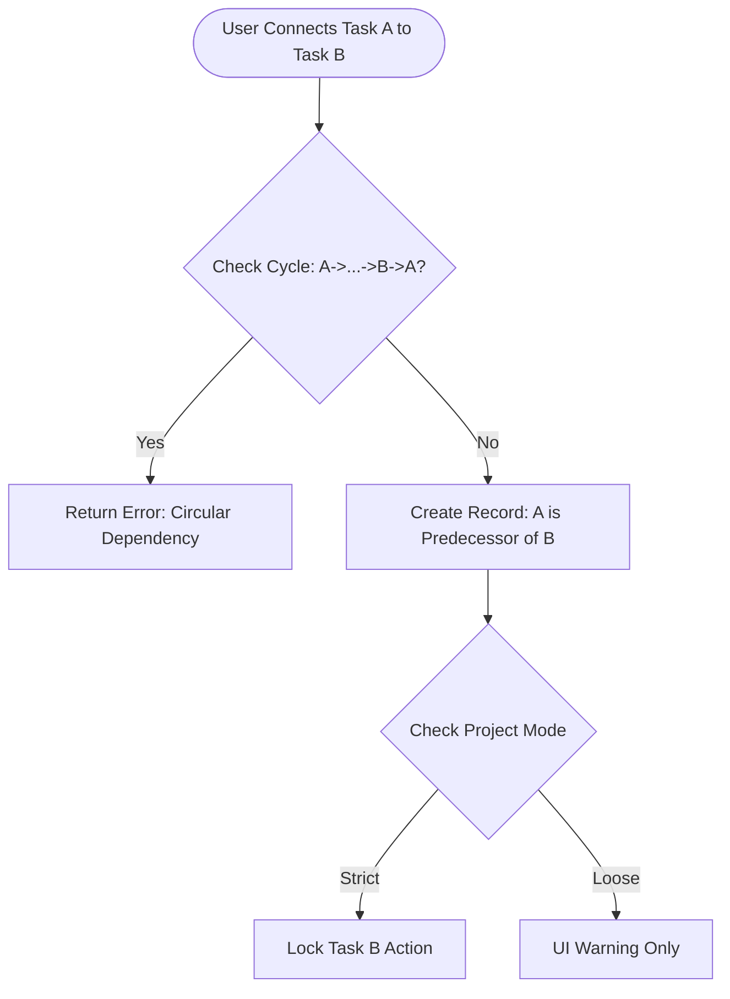

**Project**: PronaFlow
**Version**: 1.0
**State**: Draft
*Last updated: Jan 04, 2026*

---
# 1. Business Overview
Trong hệ thống PronaFlow, Task (Công việc) là đơn vị nguyên tử (Atomic Unit) của giá trị. Mọi hoạt động quản trị, cộng tác và đo lường đều xoay quanh thực thể này. Module này chịu trách nhiệm về:
1. Work Breakdown Structure ( #WBS): Phân rã dự án thành các phân quản lý được: `Task Lists` -> `Tasks` -> `Subtasks`
	1.  Task Lists (Danh sách công việc): Đóng vai trò là các "Container" dùng để gom nhóm các công việc. Tùy theo phương pháp quản lý (Waterfall hay Agile), Task List có thể đại diện cho các Giai đoạn (Phrase), Print, hoặc các Nhóm chức năng tùy theo cấu hình mà người dùng triển khai trong dự án của họ.
	2. Tasks (Công việc): Đơn vị thực thi chính, chứa đầy đủ thông tin về tiến độ, thời gian, và người thực hiện. Task bắt buộc nằm trong một Task List.
	3. Subtasks (Công việc con): Các đầu mục kiểm tra (Checklist) nhỏ nằm trong Task, giúp chia nhỏ khối lượng công việc phức tạp.
2. Execution: Cung cấp đầy đủ công cụ để thực thi công việc (Gán người, đặt hạn, dán nhãn).
3. Orchestrain (Điều phối): Quản lý dự phụ thuộc và lặp lại để đảm bảo dòng chảy công việc không bị gián đoạn.
# 2. User Stories & Acceptance Criteria
## 2.1. Feature: Task List Management
### User Story 4.1.
Là một Quản lý dự án, Tôi muốn tạo, sắp xếp và quản lý các Task List trong dự án. Để phân chia dự án thành các giai đoạn rõ ràng hoặc các nhóm việc logic.
### Acceptance Criteria ( #AC)
#### AC 1 - Container Management
- **Action:** CRUD Task List.
- **Constraint:** Không thể xóa một List nếu nó đang chứa Task (Phải di chuyển Task đi nơi khác hoặc Archive cả List).
#### AC 2 - Drag & Drop Ordering
- **Action:** Kéo thả List A sang vị trí của List B.
- **System:** Cập nhật trường `position` trong DB. Đảm bảo trải nghiệm mượt mà, không bị giật (Optimistic UI update).
## 2.2. Feature: Task Execution
### User Story 4.2.
Là một Thành viên dự án, Tôi muốn tạo một Task mới nằm trong một Task List cụ thể, Để xác định rõ công việc cần làm, thời hạn và mức độ ưu tiên.
### Acceptance Critera ( #AC)
#### AC 1 - Parent Constraint:
- Rule: Một Task không thể tồn tại độc lập. Khi tạo Task, hệ thống buộc phải gán `task_list_id`
#### AC 2 - Metadata Management:
- Hỗ trợ cập nhật các trường thông tin quan trọng:
	- `Title` (Bắt buộc).
	- `Assigness` (Cho phép gán nhiều người, nhưng phải chỉ định 1 người chịu trách nhiệm chính - Primary Owner).
	- `Priority`: Mức độ ưu tiên (Chọn từ Danh mục: `Low`, `Medium`, `High`, `Urgent`)
	- `Status`: Trạng thái xử lý của Task (`Not-Started`, `In-Progress`, `Done`).
	- `Date Range`: `Start Date` và `End Date` ($End Date >= Start Date$), có thể có giờ cụ thể (e.g. 17:00 31/12).
	- `Estimated Hours`: Ước lượng thời gian làm việc (số giờ) (Input cho [[10 - Intelligent Decision Support System|Module 10]] và [[11 - Advanced Analytics and Reporting|Module 11]])
	- `Is Milestone`: Đánh dấu đây là cột mốc quan trọng của dự án.
- Trigger: Khi tạo xong, hệ thống gửi thông báo cho người được gán ([[7 - Even-Driven Notification System|Module 7]])
#### AC 3 - Tags & Labels System
- Action: User có thể tạo mới hoặc chọn tag có sẵn.
- Visual: Mỗi tag có một màu sắc riêng biệt để nhận diện trên Board.
- Scope: Tag được quản lý ở cấp độ Workspace để tái sử dụng giữa các dự án.
- Xem chi tiết tại: [[]]
#### AC 44 - Time Tracking Integration
- **UI:** Hiển thị nút "Start Timer" ngay trên Task Detail.
- **Logic:** Khi bấm Start -> Gọi API sang **Module 11** để bắt đầu tính giờ. Khi bấm Stop -> Lưu Log.
## 2.3. Feature: Subtasks.
### User Story 4.3.
- Là một Người thực hiện (Assignee), 
- Tôi muốn chia nhỏ Task thành danh sách kiểm tra (Checklist),
- Để kiểm soát các bước thực hiện chi tiết mà không cần tạo thêm Task lớn.
### Acceptance Criteria ( #AC)
#### AC 1 - Checklist Behavior
- **Input:** Nhập text và Enter để thêm dòng mới nhanh.
- **State:** Mỗi subtask có checkbox (Done/Not Done).
- **Progress Bar:** Task cha hiển thị thanh tiến độ dựa trên % Subtask hoàn thành (Ví dụ: 3/4 Subtasks = 75%).
#### AC 2 - Assignable Subtasks
- Cho phép gán người thực hiện riêng cho từng Subtask (nếu cần thiết). Nếu không gán, mặc định thuộc về người làm Task cha.
- Scope: Đối với gán Subtask chỉ cho phép gán cho những người được gán trong Task cha.
#### AC 3 - Ordering:
- Các Subtask có thể được sắp xếp lại thứ tự (`position`) để thể hiện quy trình thực hiện các bước.
## 2.4. Feature: Task Dependencies (Predecessor & Successor).
### User Story 4.4.
- Là một Quản lý dự án, 
- Tôi muốn thiết lập các mối quan hệ giữa Task A và  Task B, 
- Để đảm bảo quy trình thực hiện đúng trình tự.
### Acceptance Criteria ( #AC)
#### AC 1 - Dependency Definition
- **Data Model:** Định nghĩa quan hệ `Predecessor` (Task A - Việc trước) và `Successor` (Task B - Việc sau).
- **Default Type:** Hỗ trợ chuẩn **Finish-to-Start (FS)**.
    - *Logic:* Task B không thể chuyển sang `In-Progress` nếu Task A chưa `Done`.
#### AC 2 - Cycle Detection Validation
- **Logic:** Khi User cố gắng nối A -> B, hệ thống kiểm tra đồ thị. Nếu phát hiện B đang gián tiếp chặn A (A -> ... -> B), ngăn chặn hành động và báo lỗi `TASK_001: Circular dependency detected`.
## 2.5. Feature: Recurring Tasks (Công việc lặp lại)
### User Story 4.5
Là một Team Lead, Tôi muốn thiết lập Task "Gửi báo cáo tuần" tự động lặp lại vào thứ 6 hàng tuần, Để không phải tạo thủ công.
### Acceptance Criteria (#AC)
#### AC 1 - Recurrence Pattern
- Hỗ trợ các mẫu: 
	- Daily, 
	- Weekly (chọn ngày trong tuần), 
	- Monthly, 
	- Custom.
#### AC 2 - Generation Strategy (Chiến lược sinh Task)
- **Lazy Generation:** Hệ thống không sinh ra hàng nghìn task tương lai ngay lập tức.
- **Logic:** Chỉ sinh ra Task tiếp theo (Next Instance) khi Task hiện tại được đánh dấu là **Done** hoặc đến ngày kích hoạt.
- **Prefix:** Tự động thêm suffix vào tên task (e.g., "Report [2025-01-01]", "Report [2025-01-08]").
## 2.6. Feature: Milestones (Cột mốc Dự án)
### User Story 4.6
Là một Project Manager, Tôi muốn đánh dấu các Task quan trọng là "Cột mốc", Để dễ dàng theo dõi các điểm chốt (Checkpoints) quan trọng của dự án trên timeline.
### Acceptance Criteria ( #AC)
#### AC 1 - Milestone Definition
- **Input:** Toggle `Is Milestone = True`.
- **Constraint:** Milestone có `Duration = 0` (Start Date = End Date). Không cho phép nhập Estimated Hours.
#### AC 2 - Visual Distinction
- Hiển thị dưới dạng hình thoi (Diamond shape) trên biểu đồ Gantt và có icon nổi bật trong danh sách Task để phân biệt với Task thường.

## 2.7. Feature: Bulk Actions (Thao tác hàng loạt)
### User Story 4.7
Là một Người dùng, Tôi muốn chọn và chỉnh sửa nhiều Task cùng một lúc, Để tiết kiệm thời gian khi cần thay đổi trạng thái hoặc người thực hiện cho cả nhóm việc.
### Acceptance Criteria ( #AC)
#### AC 1 - Multi-select Interaction
- **Interaction:** Giữ phím `Shift` hoặc `Ctrl/Cmd` để chọn nhiều Task, hoặc tick vào checkbox đầu dòng.
- **Floating Toolbar:** Khi có >1 task được chọn, hiển thị thanh công cụ nổi phía dưới màn hình: "X Tasks selected".
#### AC 2 - Batch Operations
- Hỗ trợ các hành động:
    - `Move to...`: Di chuyển sang List khác hoặc Dự án khác.
    - `Set Status/Priority/Assignee`: Cập nhật đồng loạt giá trị mới.
    - `Delete`: Xóa nhiều task (Yêu cầu confirm).
## 2.8. Feature: Custom Fields (Trường tùy chỉnh)
### User Story 4.8
Là một **Pro User**, Tôi muốn định nghĩa thêm các trường dữ liệu đặc thù (như "Ticket ID", "Khách hàng"), Để quản lý thông tin sát với nghiệp vụ thực tế của công ty.
### Acceptance Criteria ( #AC)
#### AC 1 - Field Definition (Project Level)
- PM có thể tạo Custom Field trong Project Settings.
- **Data Types:** Text, Number, Dropdown (Single/Multi select), Date, Checkbox, URL.
#### AC 2 - Tier Enforcement (RBAC)
- Tính năng này chỉ khả dụng cho Workspace sử dụng gói **Pro** hoặc **Enterprise** (Check quota từ Module 13). Gói Free bị khóa chức năng này.
#### AC 3 - Task Input
- Các trường tùy chỉnh sẽ hiển thị ở khu vực riêng trong Task Detail. Dữ liệu nhập vào phải được Validate theo kiểu dữ liệu đã định nghĩa.
## 2.9. Feature: Task Templates
### User Story 4.9
Là một Team Lead, Tôi muốn lưu cấu trúc của một Task mẫu (gồm mô tả, checklist, tag) và tái sử dụng nó, Để chuẩn hóa quy trình giao việc cho nhân viên.
### Acceptance Criteria ( #AC)
#### AC 1 - Save as Template
- Từ một Task đang có, chọn "Save as Template". Hệ thống lưu lại: Description, Subtasks, Tags, Priority (không lưu Assignee và Due Date).
#### AC 2 - Instantiate from Template
- Khi tạo Task mới, hiển thị dropdown: "Apply Template".
- Khi chọn, dữ liệu từ Template sẽ đổ vào form tạo Task.
## 2.10. Feature: Watchers/Followers (Người theo dõi)
### User Story 4.10
Là một Stakeholder, Tôi muốn theo dõi một Task mà tôi không trực tiếp thực hiện, Để nhận được thông báo mỗi khi có cập nhật mới về tiến độ hoặc thảo luận.
### Acceptance Criteria ( #AC)
#### AC 1 - Watch Logic
- **Manual:** Nút toggle hình con mắt (Eye Icon). Bấm để Follow/Unfollow.
- **Auto-watch:** Người tạo Task (Creator) và Người comment (Commenter) tự động được thêm vào danh sách Watchers (trừ khi họ tắt thủ công).
#### AC 2 - Notification Trigger
- Danh sách Watchers sẽ được [[7 - Even-Driven Notification System|Module 7]] sử dụng để gửi thông báo khi có sự kiện thay đổi (`task.updated`, `comment.created`).

## 2.11. Feature: Execution Constraints under Locked Plan (Ràng buộc Thực thi khi Kế hoạch bị Khóa)
### User Story 4.11
Là một Thành viên dự án, Tôi muốn biết những thông tin nào mình được phép chỉnh sửa khi dự án đã chốt kế hoạch (Baseline), Để tôi cập nhật tiến độ mà không vô tình phá vỡ cam kết với khách hàng.
### Acceptance Criteria (#AC)

#### AC 1 - Allowed Actions (Hành động được phép)

- Dù Plan đang ở trạng thái **Locked**, User vẫn được quyền:
    - Thay đổi `Status` (Ví dụ: In-Progress -> Done).
    - Cập nhật `% Complete`.
    - Thêm `Comment`, `Attachment`.
    - Log `Time` (Time Tracking).
    - Đánh dấu `Subtask` là hoàn thành.
    - **Lý do:** Đây là các hành động thuộc về **Thực thi (Execution)**, không làm thay đổi cấu trúc kế hoạch.
#### AC 2 - Restricted Actions (Hành động bị hạn chế)
- Khi Plan = **Locked**, hệ thống vô hiệu hóa (Disable/Gray-out) các trường sau trên Form chi tiết Task:
    - `Start Date` / `End Date` (Ngày kế hoạch).
    - `Duration`.
    - `Dependency` (Không được nối thêm hoặc cắt bỏ dây).
- **Exception:** Chỉ **Project Manager** mới có quyền mở khóa tạm thời (Override) hoặc phải đi qua quy trình Change Request (Module 5).
#### AC 3 - Scope Creep Prevention (Ngăn chặn phình to phạm vi)
- **Constraint:** Không cho phép tạo mới **Task cha (Parent Task)** trực tiếp vào danh sách khi Plan đang Lock.
- **Allowed:** Vẫn cho phép tạo thêm **Subtask** (vì Subtask được xem là chi tiết hóa cách làm, miễn là không làm thay đổi ngày kết thúc của Task cha).
# 3. Business Rules
## 3.1. Quy tắc Kế thừa (Inheritance):
- Task con không tự động kế thừa Assignee từ Task cha (để linh hoạt), nhưng nên kế thừa quyền truy cập (Permissions).
## 3.2. Quy tắc Ràng buộc Custom Fields:
- Tối đa 50 Custom Fields cho mỗi dự án (để bảo đảm hiệu năng render UI).
- Custom Field khi xóa sẽ mất vĩnh viễn dữ liệu đã nhập trong các Task, cần cảnh báo kỹ.
## 3.3. Quy tắc Dependency Chặt chẽ (Strict Dependency):
- Nếu cấu hình Project là `Strict Mode`: Hệ thống **khóa** (Disable) nút "Start" hoặc "Complete" của Task Successor nếu Task Predecessor chưa xong.
- Nếu `Loose Mode` (Mặc định): Chỉ hiển thị cảnh báo (Warning Toast) nhưng vẫn cho phép làm.
## 3.4. Quy tắc "Actual vs Planned" (Thực tế vs Kế hoạch)
- Phân hệ 4 cần phân biệt rõ hai bộ dữ liệu ngày tháng:
    1. **Planned Dates (Baseline):** Ngày cam kết (Do Module 5 quản lý, bị Read-only khi Lock).
    2. **Actual Dates:** Ngày thực tế (Do Module 4 ghi nhận).
        - _Actual Start:_ Tự động điền `NOW()` khi Task chuyển sang `In-Progress`.
        - _Actual End:_ Tự động điền `NOW()` khi Task chuyển sang `Done`.
- **Logic:** Việc nhân viên làm xong sớm hay muộn (Actual khác Planned) là chuyện bình thường, hệ thống ghi nhận sự chênh lệch này để tính KPI, chứ không chặn nhập liệu.
## 3.5. Quy tắc "Auto-Push" khi trễ hạn
- **Vấn đề:** Task A có Deadline hôm qua (Planned End = Yesterday), nhưng hôm nay vẫn chưa xong (`Status != Done`).
- **Xử lý:**
    - Nếu Plan **Unlocked**: Hệ thống có thể tự động đẩy Planned End sang hôm nay (Auto-reschedule).
    - Nếu Plan **Locked**: Giữ nguyên Planned End là ngày hôm qua (để ghi nhận là Trễ hạn - Overdue). Hệ thống hiển thị nhãn **"Overdue by X days"** màu đỏ.
# 4. Theoretical Basis (Cơ sở Lý luận)
## 4.1. Work Breakdown Structure (WBS)
Module này tuân thủ nguyên tắc phân rã công việc WBS:
- **Level 1:** Project.
- **Level 2:** Task Lists (Phases/Epics).
- **Level 3:** Tasks (Work Packages).
- **Level 4:** Subtasks (Activities). Giúp quản lý sự phức tạp bằng cách chia nhỏ vấn đề ("Divide and Conquer").
## 4.2. Định luật Brooks (Brooks's Law)

> "Thêm nhân lực vào một dự án phần mềm đang chậm tiến độ sẽ chỉ làm nó chậm thêm."

Áp dụng vào tính năng **Activity Log & Dependencies**: Việc giao tiếp không rõ ràng (Implicit Communication) là nguyên nhân gây chậm trễ. Hệ thống làm rõ các phụ thuộc và lịch sử thay đổi để giảm chi phí giao tiếp (Communication Overhead), giúp việc thêm người mới (nếu cần) dễ dàng hơn nhờ lịch sử minh bạch.
## 4.3. Getting Things Done (GTD Methodology)
Hỗ trợ tư duy GTD thông qua các trạng thái Task:
- **In-Basket:** Task mới tạo (chưa phân loại).
- **Next Action:** Task có ngày và người làm cụ thể.
- **Waiting For:** Task bị chặn (Blocked by dependency).
- **Someday/Maybe:** Task ở trạng thái "Hold".
## 4.4. Sơ đồ Luồng xử lý Dependency:

## 4.5. Dependency Types Matrix
| **Mã (Code)** | **Tên loại (Type)**  | **Ký hiệu**                   | **Mô tả Quy chuẩn (Logic)**                                                              | **Ví dụ Thực tế (Business Case)**                                                   | **Mức độ Hỗ trợ trong PronaFlow**          |
| ------------- | -------------------- | ----------------------------- | ---------------------------------------------------------------------------------------- | ----------------------------------------------------------------------------------- | ------------------------------------------ |
| **FS**        | **Finish-to-Start**  | $A \rightarrow B$             | **Task B** không thể bắt đầu cho đến khi **Task A** kết thúc. ($Start_B \geq End_A$)  | Phải _đổ móng_ (A) xong thì mới được _xây tường_ (B).                               | **Mặc định (Default)** ✅ Hỗ trợ đầy đủ. |
| **SS**        | **Start-to-Start**   | $Start_A \rightarrow Start_B$ | **Task B** không thể bắt đầu cho đến khi **Task A** bắt đầu. ($Start_B \geq Start_A$) | Khi bắt đầu _viết code_ (A) thì có thể bắt đầu _viết test case_ (B) song song.      | ⚠️ **Optional** (Cân nhắc cho Phase 2). |
| **FF**        | **Finish-to-Finish** | $End_A \rightarrow End_B$     | **Task B** không thể kết thúc cho đến khi **Task A** kết thúc. ($End_B \geq End_A$)   | Việc _nghiệm thu_ (B) chỉ xong khi việc _sửa lỗi_ (A) đã xong hoàn toàn.            | ⚠️ **Optional** (Cân nhắc cho Phase 2). |
| **SF**        | **Start-to-Finish**  | $Start_A \rightarrow End_B$   | **Task B** không thể kết thúc cho đến khi **Task A** bắt đầu. ($End_B \geq Start_A$)  | Ca trực của _bảo vệ cũ_ (B) chỉ kết thúc khi _bảo vệ mới_ (A) đã đến và bắt đầu ca. | ❌ **Không hỗ trợ** (Ít dùng, gây rối).  |
## 4.6. Iron Triangle Constraints (Ràng buộc Tam giác sắt)
Trong quản lý dự án, thay đổi một cạnh sẽ ảnh hưởng các cạnh còn lại. Phân hệ 4 thực thi các ràng buộc này:
- **Scope (Phạm vi):** Được cố định bởi danh sách Task. Khi Lock Plan -> Cố định Scope.
- **Time (Thời gian):** Được cố định bởi Start/End Date.
- **Cost (Chi phí):** Được cố định bởi Resource Assignee. -> Việc ngăn chặn thêm Task mới hoặc đổi người khi Plan Locked chính là bảo vệ sự toàn vẹn của Tam giác sắt dự án.