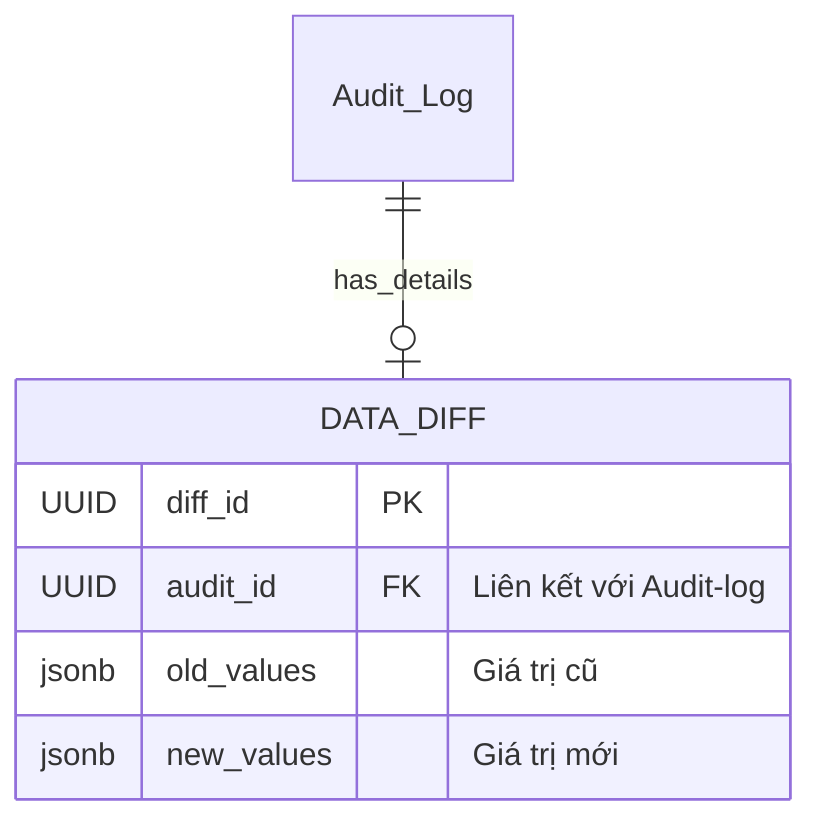

| Field      | Type  |     |                           |
| ---------- | ----- | --- | ------------------------- |
| diff_id    | UUID  | PK  |                           |
| audit_id   | UUID  | FK  | Liên kết với [[AuditLog]] |
| old_values | jsonb |     | Giá trị cũ (Key-Value)    |
| new_values | jsonb |     | Giá trị mới (Key-Value)   |

