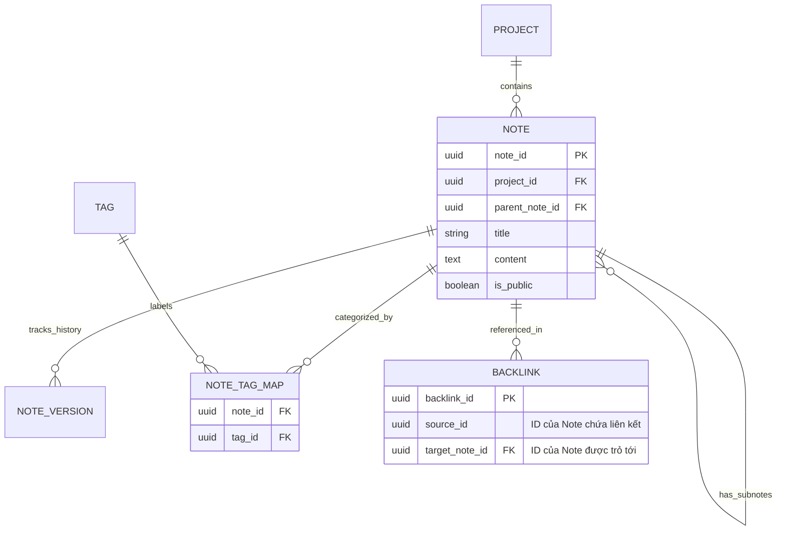

# Module 6
| Field             | Type      | Key | Description                                           |             |
| ----------------- | --------- | --- | ----------------------------------------------------- | ----------- |
| note_id ()        | UUID      | PK  |                                                       |             |
| project_id ()     | UUID      | FK  | Liên kết với dự án sở hữu.                            | [[Project]] |
| parent_note_id () | UUID      | FK  | Cho phép cấu trúc phân cấp (NULL nếu là root).        |             |
| author_id ()      | UUID      | FK  |                                                       | [[Users]]   |
| title             | varchar   |     | Tiêu đề ghi chú                                       |             |
| content           | text      |     | Nội dung định dạng Rich-text/Markdown.                |             |
| status            | enum      |     | DRAFT, PUBLISHED, ARCHIVED.                           |             |
| created_at        | timestamp |     |                                                       |             |
| is_public         | boolean   |     | Cho phép xuất bản ra ngoài dự án (Public Publishing). |             |

