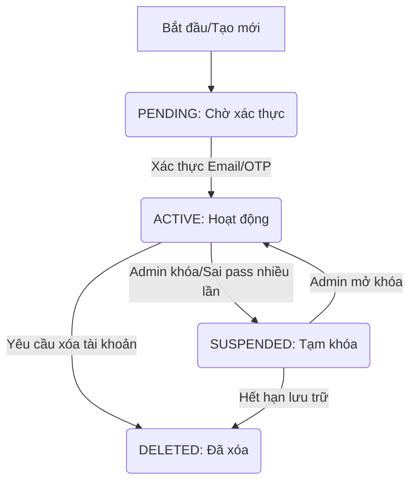

> Định danh cốt lõi của hệ thống

# Module 1

| Field             | Type      | Key | Constrant                                                     | Note                                                                             |
| ----------------- | --------- | --- | ------------------------------------------------------------- | -------------------------------------------------------------------------------- |
| id                | UUID      | PK  |                                                               | Định danh duy nhất kiểu UUID                                                     |
| email             | varchar   |     | unique                                                        | Địa chỉ email của người dùng                                                     |
| username          | varchar   |     | unique                                                        | Tên đăng nhập                                                                    |
| password_hash     | varchar   |     | nullable (OAuth user)                                         | Chuỗi mật khẩu đã mã hóa. Có thể để trống đối với người dùng đăng nhập qua OAuth |
| status            | enum      |     | not-null, in`PENDING` / `ACTIVE` / `SUSPENDED` / `DELETED` | Trạng thái tài khoản                                                             |
| email_verified_at | timestamp |     | not-null                                                      | Thời điểm xác thực email thành không                                             |
| created_at        | timestamp |     | not-null                                                      | Thời điểm tạo bản ghi                                                            |
| updated_at        | timestamp |     | not-null                                                      | Thời điểm cập nhật bản ghi                                                       |
# User Status Workflow
Tuân thủ trong file: [[user_status.json]]

