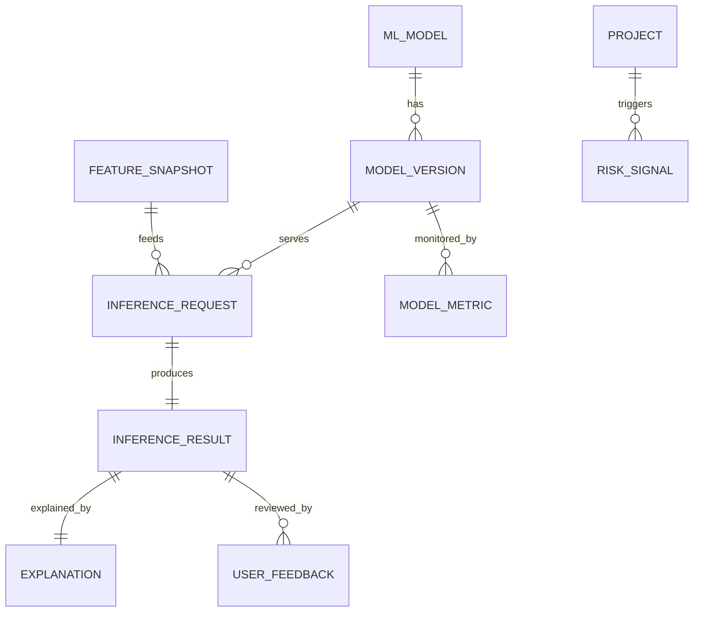

**Project**: PronaFlow 
**Version**: 1.0
**State**: Draft 
_**Last updated:** Jan 11, 2026_

---

> Vai trò: Decision Support - Không tự ý ra quyết định.
> Triết lý: Explainable • Privacy-Preserving • Workspace-Isolated

# Entity
| Layer          | Mục tiêu        | Entity                            | Files                                       |
| -------------- | --------------- | --------------------------------- | ------------------------------------------- |
| Feature Store  | Đặc trưng ML    | FeatureSnapshot                   | [[FeatureSnapshot]]                         |
| Model Registry | Quản lý mô hình | MLModel, ModelVersion             | [[MLModel]] [[ModelVersion]]             |
| Inference      | Gợi ý & dự đoán | InferenceRequest, InferenceResult | [[InferenceRequest]] [[InferenceResult]] |
| Explanation    | XAI             | Explanation                       | [[Explanation]]                             |
| Feedback       | Học liên tục    | UserFeedback                      | [[UserFeedback]]                            |
| Monitoring     | Drift & Quality | ModelMetric                       | [[ModelMetric]]                             |
| Alert          | Cảnh báo rủi ro | RiskSignal                        | [[RiskSignal]]                              |
# ERD

# Mapping Function into Entity
|Đặc tả|Entity|
|---|---|
|Predictive Estimation|InferenceResult (REGRESSION)|
|Confidence Interval|result_payload + confidence_score|
|Smart Assignee|RANKING + Explanation|
|Explainable AI|Explanation|
|Threshold 70%|ModelVersion.confidence_threshold|
|Privacy / Anonymization|FeatureSnapshot|
|Workspace Isolation|workspace_id|
|Velocity anomaly|RiskSignal|