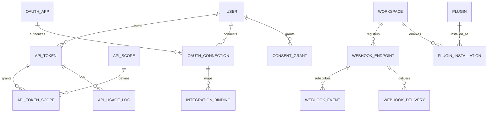

**Project**: PronaFlow 
**Version**: 1.0
**State**: Draft 
_**Last updated:** Jan 11, 2026_

---

> Vai trò: **PronaFlow = Platform / Command Center**, không chỉ là app  
> Triết lý: **Loose Coupling – Secure by Design – API Economy**

# Entity

|Layer|Chức năng|Entity|
|---|---|---|
|API Access|REST API + PAT|ApiToken, ApiScope|
|Webhook|Outbound event|WebhookEndpoint, WebhookEvent, WebhookDelivery|
|OAuth|Native connectors|OAuthApp, OAuthConnection|
|Integration|Mapping dữ liệu|IntegrationBinding|
|Plugin|Marketplace & SDK|Plugin, PluginInstallation|
|Governance|Rate limit & consent|ApiUsageLog, ConsentGrant|

# ERD
