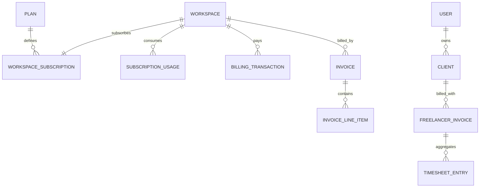

**Project**: PronaFlow 
**Version**: 1.0
**State**: Draft 
_**Last updated:** Jan 14, 2026_

---
# Entity

# ERD

```mermaid
erDiagram
    PLAN ||--o{ WORKSPACE_SUBSCRIPTION : defines
    WORKSPACE ||--|| WORKSPACE_SUBSCRIPTION : subscribes

    WORKSPACE ||--o{ SUBSCRIPTION_USAGE : consumes
    WORKSPACE ||--o{ BILLING_TRANSACTION : pays
    WORKSPACE ||--o{ INVOICE : billed_by

    INVOICE ||--o{ INVOICE_LINE_ITEM : contains

    USER ||--o{ CLIENT : owns
    CLIENT ||--o{ FREELANCER_INVOICE : billed_with
    FREELANCER_INVOICE ||--o{ TIMESHEET_ENTRY : aggregates

```
