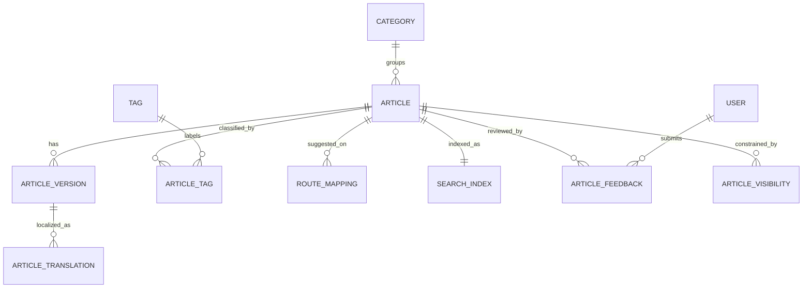

**Triết lý:** Context-aware • Self-service • PLG-ready  
**Bản chất:** Knowledge Management + Search + Feedback (KHÔNG phải ticketing)

---

# Entity

| Domain          | Mục tiêu            | Entity                                  |
| --------------- | ------------------- | --------------------------------------- |
| Content Core    | Bài viết & cấu trúc | [[Article]], [[ArticleVersion]]         |
| Taxonomy        | Phân loại           | [[Category]] [[Tag]]                 |
| Localization    | Đa ngôn ngữ         | [[ArticleTranslation]]                  |
| Contextual Help | Gợi ý theo ngữ cảnh | [[RouteMapping]]                        |
| Search          | Semantic + Keyword  | [[SearchIndex]]                         |
| Feedback        | Helpfulness & gap   | [[ArticleFeedback]] [[FailedSearch]] |
| Visibility      | Public / Private    | [[ArticleVisibility]]                   |

# ERD

# Mapping
|Tài liệu|Entity|
|---|---|
|Contextual Help Widget|RouteMapping|
|Embedded Reader|ArticleVersion|
|Semantic Search|SearchIndex.embedding_vector|
|Keyword Search|SearchIndex.keywords|
|Versioning|ArticleVersion|
|Localization|ArticleTranslation|
|Yes/No feedback|ArticleFeedback|
|Failed searches|FailedSearch|
|Public vs Private KB|ArticleVisibility|
