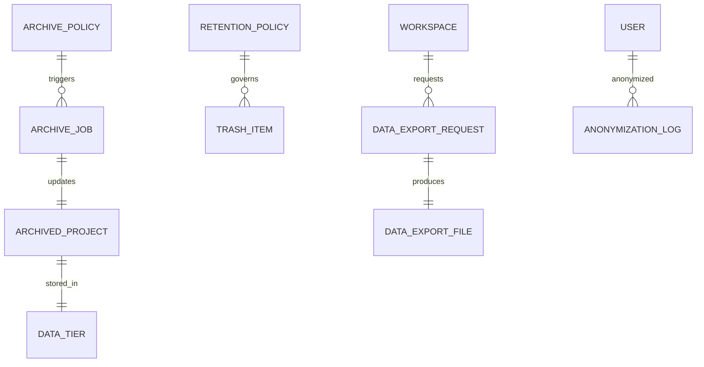

**Project**: PronaFlow 
**Version**: 1.0
**State**: Draft 
_**Last updated:** Jan 11, 2026_

---

> Mục tiêu: **Hiệu năng bền vững – Tuân thủ pháp lý – Quản trị vòng đời dữ liệu**

# Entity

|Nhóm|Entity|
|---|---|
|Archiving|ArchivePolicy, ArchiveJob|
|Data State|ArchivedProject, DataTier|
|Soft Delete|TrashItem|
|Retention|RetentionPolicy|
|Export|DataExportRequest, DataExportFile|
|Compliance|AnonymizationLog|
# ERD

# Mapping Module into Entity
|Đặc tả|Entity|
|---|---|
|Auto archive 180 ngày|ArchivePolicy|
|Read-only archived|ArchivedProject.is_read_only|
|Trash bin 30 ngày|TrashItem.purge_after|
|Async export|DataExportRequest|
|Secure link 24h|DataExportFile.expires_at|
|GDPR Right to Erasure|RetentionPolicy + AnonymizationLog|